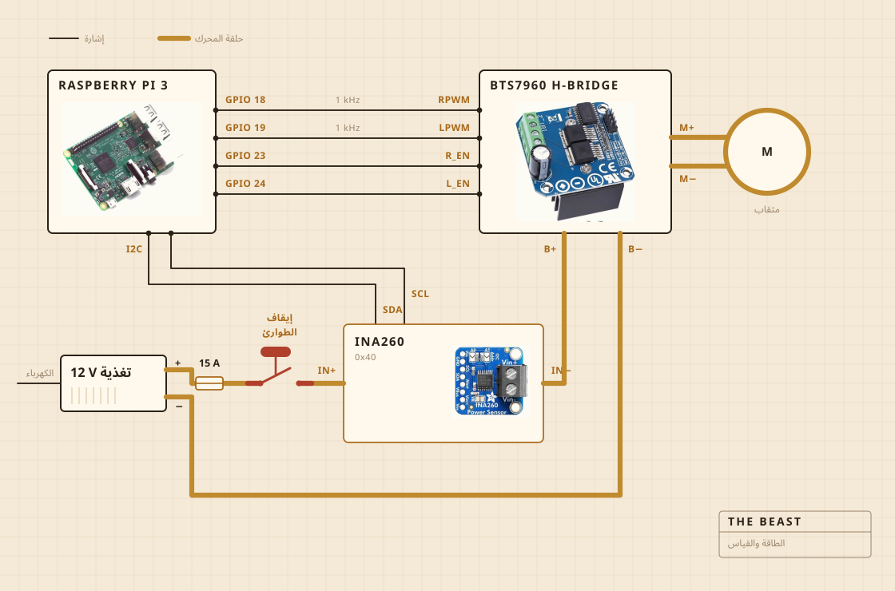

## من أي شيء صُنعت

المثقاب اللاسلكي هو الذي يدور. يقعد في ملزمة مثبتة ببراغي على لوح تقطيع، واللوح هو الذي يحفظ كل شيء على استقامته فوق القدر. ورأس الممخضة خشب صلب على عمود فولاذي، مربوط ببراغي لا بلاصق، وهذا هو سبب صناعتي له بدلا من شرائه.

الإلكترونيات تسكن في علبة طعام بلاستيكية شفافة، أكثرها لأرى إن كان شيء قد احترق. وراسبيري باي يتولى التسجيل. والزر الأصفر الكبير يقطع الكهرباء عن المحرك، ولا شيء في البرمجيات يستطيع أن ينقض ذلك.

| المحرك | مثقاب لاسلكي، ممسوك بملزمة، يعمل بسرعة أقل بكثير من سرعته الكاملة |
| الممخضة | خشب صلب وفولاذ مقاوم للصدأ، مصنوعة لا مشتراة |
| الحرارة | موقد كهربائي، يشغله ويطفئه منظم للتيار المتردد |
| الهيكل | لوح تقطيع وعلبة طعام بلاستيكية |
| الكهرباء | مزود طاقة مفتاحي 12 V، من قابس الحائط |
| الدماغ | راسبيري باي، يسجل في ملف CSV |
| الحاسة | التيار والجهد أثناء الخض، ومجس في القدر أثناء الطبخ |
| الإيقاف | زر كبير واحد، موصول بالأسلاك مباشرة |

## كيف وُصلت

أربعة أسلاك إشارة وحلقة واحدة سميكة. راسبيري باي يحسب كم القوة وفي أي اتجاه، وجسر H هو الذي يدفع التيار فعلا، والاثنان لا يلتقيان أبدا. ولا شيء يلمسه راسبيري باي يحمل أكثر من بضعة ميلي أمبير.

الزر هو الجزء الذي يستحق النظر. ليس موصولا براسبيري باي أصلا. يقعد في حلقة المحرك ويقطعها، فلا يستطيع أي خلل برمجي أن يقنعه بألا يتوقف. والذي يستطيعه راسبيري باي هو أن يلاحظ. إن كان يطلب ثلاثين في المئة ورجع المستشعر بأقل من مئتي ميلي أمبير، استنتج أن الحلقة مفتوحة وتوقف عن الطلب.

والمستشعر على الحلقة نفسها، لكن الجانب المنطقي منه يعمل من راسبيري باي، ولهذا يبقى يجيب حين تكون التغذية مقطوعة. وهذه هي حيلة فحص الزر كلها.

## أين توضع

فوق الحوض. القدر يدخل في الحوض، وفوقه غطاء مسطح مثقوب للعمود، وكل ما يهرب ينزل في مكان لا يهم.

هذا هو الجزء الذي لا يضعه أحد في الرسوم ثلاثية الأبعاد. نصف بناء أي شيء في مطبخ هو أن تقرر إلى أين يُسمح للفوضى أن تذهب.

## ما الذي تراقبه

أثناء الخض، التيار والجهد على خط المحرك، مقيسين مرة كل ثانية تقريبا ومكتوبين في ملف مباشرة. وأثناء الطبخ، مجس في القدر بدلا من ذلك، والمنظم يشغل الموقد ويقطعه ليحفظ الرقم.

لا ميكروفون ولا كاميرا، وهذا هو الشيء التالي الذي أريد إصلاحه. والرهان حتى الآن كان أن الحمل وحده إن كفى لإيجاد لحظة الانفصال، فبقية الحواس تستطيع أن تنتظر.

## ما الذي تقرره

أمران. الأول هل صعد الحمل ثم هبط بما يكفي لإعلان انفصال الزبدة. والثاني أن تبقى الحرارة عند 250 F، فيشتغل الموقد أو يتوقف.

هي لا تعرف ما هو الرائب. ولا تعرف ما هي الزبدة. تعرف أن رقما صعد مدة ثم هبط، وأن هذا الشكل يعني أن العمل انتهى.

