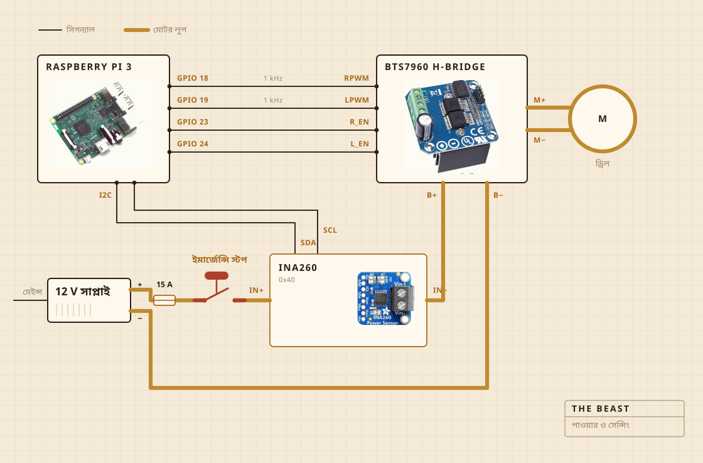

## কী দিয়ে বানানো

ঘোরানোর কাজটা করে একটা কর্ডলেস ড্রিল। সেটা বসে চপিং বোর্ডে বোল্ট দিয়ে আটকানো একটা ক্ল্যাম্পে, আর ওই বোর্ডই সবটাকে হাঁড়ির ঠিক উপরে সোজা ধরে রাখে। মন্থনদণ্ডের মাথা স্টিলের শ্যাফটের উপরে শক্ত কাঠের, আঠা নয় স্ক্রু দিয়ে জোড়া। কেনার বদলে নিজে বানানোর কারণও ওটাই।

ইলেকট্রনিকস থাকে প্লাস্টিকের একটা পরিষ্কার খাবার রাখার বাক্সে, মূলত এই জন্য যে কোথাও কিছু পুড়ে গেল কি না সেটা দেখা যায়। লগ লেখার কাজ করে একটা রাস্পবেরি পাই। বড় হলুদ বোতামটা মোটরের বিদ্যুৎ কেটে দেয়, আর সফটওয়্যারের কোনও কিছু সেটা উল্টে দিতে পারে না।

| মোটর | কর্ডলেস ড্রিল, ক্ল্যাম্পে আটকানো, পুরো গতির অনেক নিচে চলে |
| মন্থনদণ্ড | শক্ত কাঠ আর স্টেনলেস স্টিল, কেনা নয় বানানো |
| আঁচ | হটপ্লেট, এসি রেগুলেটর চালু আর বন্ধ করে |
| কাঠামো | একটা চপিং বোর্ড আর প্লাস্টিকের একটা খাবার রাখার বাক্স |
| বিদ্যুৎ | 12 V সুইচ মোড সাপ্লাই, দেয়ালের প্লাগ থেকে |
| মাথা | রাস্পবেরি পাই, একটা সিএসভি ফাইলে লিখে রাখে |
| ইন্দ্রিয় | মন্থনের সময় কারেন্ট আর ভোল্টেজ, জ্বাল দেওয়ার সময় হাঁড়ির ভিতরের প্রোব |
| থামা | একটাই বড় বোতাম, সরাসরি তারে লাগানো |

## তার কীভাবে লাগানো

চারটি সিগন্যাল তার, আর একটা মোটা লুপ। কত জোরে আর কোন দিকে, সেটা ঠিক করে পাই, কারেন্ট আসলে ঠেলে দেওয়ার কাজটা করে এইচ ব্রিজ, আর এই দুটো কখনও এক জায়গায় আসে না। পাই যে তারগুলো ছোঁয় তার কোনওটাতেই কয়েক মিলিঅ্যাম্পিয়ারের বেশি বয় না।

দেখার মতো অংশটা হল বোতাম। এটা পাইয়ের সঙ্গে লাগানোই নেই। এটা বসে মোটরের লুপে আর সেই লুপটাই ভেঙে দেয়, তাই সফটওয়্যারের কোনও গোলমাল এটাকে থামা থেকে ভুলিয়ে রাখতে পারে না। পাই যা করতে পারে সেটা হল টের পাওয়া। ত্রিশ শতাংশ চাওয়ার সময় সেন্সর যদি দুই শ মিলিঅ্যাম্পিয়ারের কম ফেরত দেয়, তাহলে ও বুঝে নেয় লুপ খোলা, আর চাওয়া বন্ধ করে দেয়।

সেন্সরও ওই একই লুপে, কিন্তু তার লজিকের দিকটা চলে পাই থেকে। এই জন্যই সাপ্লাই বন্ধ থাকলেও ও উত্তর দিতে থাকে। বোতাম পরীক্ষা করার পিছনে পুরো চালাকিটা ওটাই।

## কোথায় বসে

সিংকের উপরে। হাঁড়ি যায় বেসিনের ভিতরে, উপরে বসে শ্যাফটের জন্য ফুটো করা একটা সমান ঢাকনা, আর যা কিছু ছিটকে বেরোয় তা এমন জায়গায় পড়ে যেখানে কিছু যায় আসে না।

এই অংশটা কেউ রেন্ডারে রাখে না। রান্নাঘরে কিছু বানানোর অর্ধেকটাই হল নোংরা কোথায় যেতে পারবে সেটা ঠিক করা।

## কী দেখে

মন্থনের সময় মোটরের লাইনের কারেন্ট আর ভোল্টেজ, সেকেন্ডে মোটামুটি এক বার মেপে সোজা একটা ফাইলে লিখে রাখা। জ্বাল দেওয়ার সময় তার বদলে হাঁড়ির ভিতরের প্রোব, আর রেগুলেটর হটপ্লেট চালু আর বন্ধ করে সংখ্যাটা ধরে রাখে।

মাইক্রোফোন নেই, ক্যামেরা নেই, আর এর পরে এটাই ঠিক করতে চাই। এখন পর্যন্ত বাজিটা ছিল এই যে লোড একা মাখন ছাড়ার মুহূর্ত ধরে ফেললে বাকিটা অপেক্ষা করতে পারে।

## কী ঠিক করে

দুটি জিনিস। লোড এতটা উঠে তারপর এতটা পড়েছে কি না যে মাখন ছেড়ে গেছে বলা যায়। আর 250 F-এ বসে থাকার জন্য প্লেট চালু থাকা উচিত না বন্ধ।

দই কী, ও জানে না। মাখন কী, তাও জানে না। ও এতটুকুই জানে যে একটা সংখ্যা কিছুক্ষণ উঠেছে, তারপর পড়ে গেছে, আর ওই আকারের মানে কাজ শেষ।

