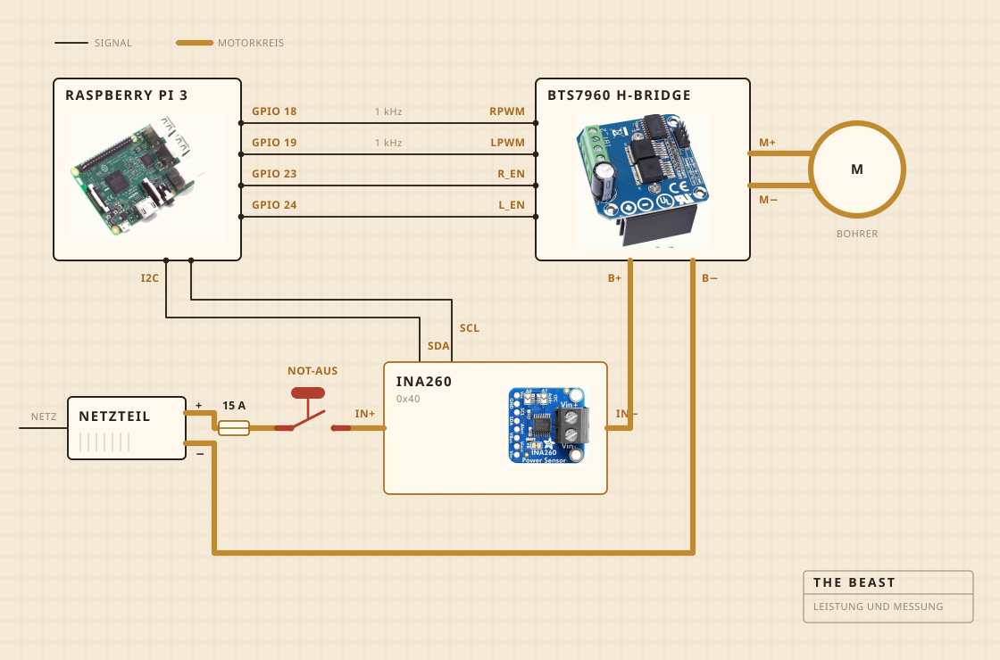

## Woraus sie besteht

Ein Akkuschrauber übernimmt das Drehen. Er sitzt in einer Klemme, die auf ein Schneidebrett geschraubt ist, und das Brett hält alles über dem Topf in einer Flucht. Der Quirlkopf ist Hartholz auf einer Stahlwelle, geschraubt statt geklebt, und genau deshalb habe ich ihn gebaut statt gekauft.

Die Elektronik wohnt in einer durchsichtigen Frischhaltedose, vor allem damit ich sehen kann, ob etwas Feuer gefangen hat. Ein Raspberry Pi übernimmt die Aufzeichnung. Der große gelbe Knopf trennt den Strom zum Motor, und keine Software darf ihn überstimmen.

| Motor | Akkuschrauber, geklemmt, läuft weit unter voller Drehzahl |
| Quirl | Hartholz und Edelstahl, gebaut statt gekauft |
| Hitze | Kochplatte, von einem Leistungsregler ein- und ausgeschaltet |
| Rahmen | Ein Schneidebrett und eine Frischhaltedose |
| Strom | Schaltnetzteil mit 12 V, aus der Steckdose |
| Hirn | Raspberry Pi, schreibt in eine CSV |
| Sinn | Strom und Spannung beim Buttern, ein Fühler im Topf beim Kochen |
| Stopp | Ein großer Knopf, fest verdrahtet |

## Wie sie verdrahtet ist

Vier Signalleitungen und ein dicker Kreis. Der Pi rechnet aus, wie stark und in welche Richtung, die H-Brücke schiebt den Strom tatsächlich, und die beiden treffen sich nie. Nichts, was der Pi berührt, führt mehr als ein paar Milliampere.

Der Knopf ist das Teil, das man sich ansehen sollte. Er ist überhaupt nicht mit dem Pi verbunden. Er sitzt im Motorkreis und trennt ihn, also kann kein Softwarefehler ihm das Anhalten ausreden. Was der Pi kann, ist es zu merken. Wenn er dreißig Prozent anfordert und der Sensor mit weniger als zweihundert Milliampere zurückkommt, schließt er daraus, dass der Kreis offen ist, und hört auf zu fordern.

Der Sensor sitzt im selben Kreis, aber seine Logikseite hängt am Pi, und deshalb antwortet er auch dann noch, wenn die Versorgung aus ist. Das ist der ganze Trick hinter der Knopfprüfung.

## Wo sie steht

Über der Spüle. Der Topf kommt ins Becken, darauf liegt ein flacher Deckel mit einem Loch für die Welle, und was entwischt, landet irgendwo, wo es nicht stört.

Das ist der Teil, den niemand in die Visualisierung packt. Die halbe Arbeit, etwas in einer Küche zu bauen, besteht darin zu entscheiden, wohin die Sauerei darf.

## Was sie beobachtet

Beim Buttern Strom und Spannung auf der Motorleitung, etwa einmal pro Sekunde abgetastet und direkt in eine Datei geschrieben. Beim Kochen stattdessen ein Fühler im Topf, und der Regler schaltet die Kochplatte zu und weg, um die Zahl zu halten.

Kein Mikrofon und keine Kamera, und das ist das Nächste, was ich ändern will. Die Wette war bisher, dass der Rest warten kann, wenn die Last allein reicht, um den Bruch zu finden.

## Was sie entscheidet

Zwei Dinge. Ob die Last weit genug gestiegen und dann gefallen ist, um den Bruch auszurufen, und ob die Platte an oder aus sein soll, um auf 250 F zu bleiben.

Sie weiß nicht, was Joghurt ist. Sie weiß nicht, was Butter ist. Sie weiß, dass eine Zahl eine Weile lang stieg und dann abfiel, und dass diese Form bedeutet, dass die Arbeit erledigt ist.

