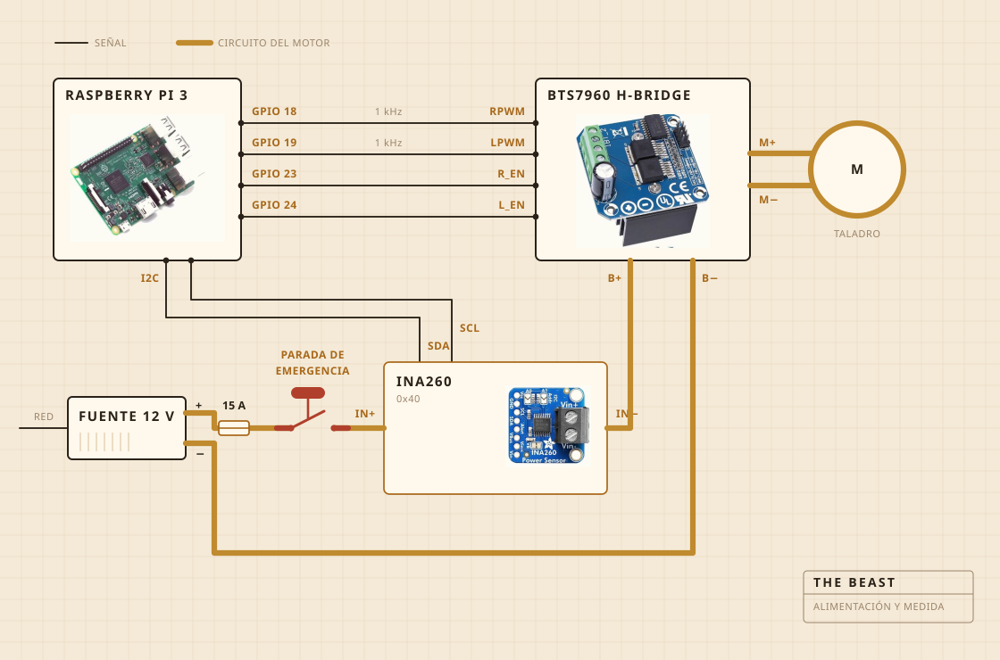

## De qué está hecha

Lo que gira es un taladro a batería. Va sujeto con una mordaza atornillada a una tabla de cortar, y es la tabla la que mantiene todo alineado sobre la olla. El cabezal del batidor es madera dura sobre un eje de acero, montado con tornillos en vez de encolado, que es justo la razón por la que lo hice en lugar de comprarlo.

La electrónica vive en una fiambrera de plástico transparente, sobre todo para poder ver si se ha prendido fuego algo. Del registro se encarga una Raspberry Pi. El botón amarillo grande corta la corriente del motor y nada del software puede pasar por encima de él.

| Motor | Taladro a batería, sujeto, girando muy por debajo de su velocidad máxima |
| Batidor | Madera dura y acero inoxidable, hecho y no comprado |
| Calor | Placa, encendida y apagada por un regulador |
| Estructura | Una tabla de cortar y una fiambrera de plástico |
| Alimentación | Fuente conmutada de 12 V, de la pared |
| Cerebro | Raspberry Pi, registrando en un CSV |
| Sentido | Corriente y tensión mientras bate, una sonda en la olla mientras cuece |
| Parada | Un botón grande, cableado directo |

## Cómo está cableada

Cuatro cables de señal y un bucle gordo. La Pi calcula con cuánta fuerza y en qué sentido, el puente en H es lo que de verdad empuja la corriente, y los dos nunca se tocan. Por nada que toque la Pi pasan más de unos pocos miliamperios.

El botón es la pieza que merece la pena mirar. No está cableado a la Pi en absoluto. Está puesto dentro del circuito del motor y lo corta, así que ningún fallo de software puede convencerlo de no parar. Lo que la Pi sí puede hacer es darse cuenta. Si está pidiendo un treinta por ciento y el sensor le devuelve menos de doscientos miliamperios, deduce que el circuito está abierto y deja de pedir.

El sensor está en ese mismo circuito, pero su parte lógica se alimenta de la Pi, y por eso sigue contestando cuando la alimentación está cortada. En eso consiste todo el truco de la comprobación del botón.

## Dónde se pone

Encima del fregadero. La olla va dentro de la cubeta, encima se apoya una tapa plana con un agujero recortado para el eje, y todo lo que se escapa cae en un sitio donde da igual.

Esta es la parte que nadie mete en el render. La mitad de construir algo en una cocina consiste en decidir adónde se le permite ir al estropicio.

## Qué vigila

Mientras bate, corriente y tensión en la línea del motor, muestreadas más o menos una vez por segundo y escritas directamente a un fichero. Mientras cuece, en su lugar una sonda dentro de la olla, y el regulador va metiendo y quitando la placa para sostener el número.

Ni micrófono ni cámara, que es lo siguiente que quiero arreglar. La apuesta hasta ahora era que si la carga por sí sola basta para encontrar el corte, lo demás puede esperar.

## Qué decide

Dos cosas. Si la carga ha subido y después ha bajado lo suficiente como para cantar el corte, y si la placa debe estar encendida o apagada para quedarse en 250 F.

No sabe lo que es el yogur. No sabe lo que es la mantequilla. Sabe que un número subió durante un rato y después se fue cayendo, y que esa forma significa que el trabajo está terminado.

