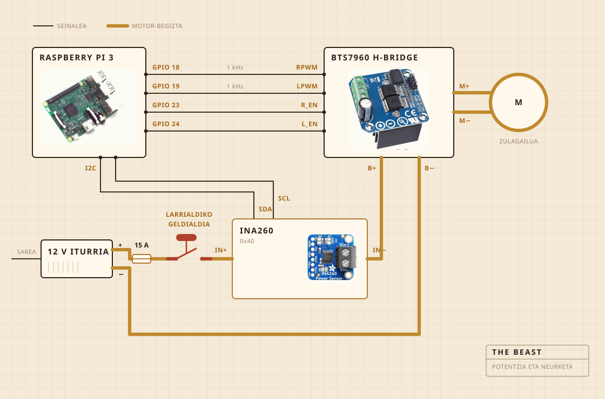

## Zerez dago eginda

Biratzen duena bateriazko zulagailu bat da. Ebakitzeko ohol bati torlojuz lotutako estukailu batean dago, eta oholak mantentzen du dena lapikoaren gainean lerrokatuta. Irabiagailuaren burua zur gogorrezkoa da, altzairuzko ardatz baten gainean, torlojuz muntatua eta ez itsatsia, eta hori da erosi beharrean neuk egiteko arrazoia.

Elektronika plastikozko janari-ontzi garden batean bizi da, batez ere zerbaitek su hartu duen ikusteko. Erregistroaz Raspberry Pi bat arduratzen da. Botoi hori handiak motorraren korrontea eteten du, eta softwareak ez du hori baliogabetzeko modurik.

| Motorra | Bateriazko zulagailua, estututa, abiadura osotik oso behera |
| Irabiagailua | Zur gogorra eta altzairu herdoilgaitza, egina eta ez erosia |
| Beroa | Plaka elektrikoa, erregulagailu batek piztu eta itzalita |
| Egitura | Ebakitzeko ohol bat eta plastikozko janari-ontzi bat |
| Elikadura | 12 V-ko iturri komutatua, hormatik |
| Burmuina | Raspberry Pi, CSV batean erregistratzen |
| Zentzumena | Korrontea eta tentsioa irabiatzean, zunda bat lapikoan egostean |
| Gelditzea | Botoi handi bat, zuzenean kableatua |

## Nola dago kableatuta

Lau seinale-kable eta begizta lodi bat. Pi-ak kalkulatzen du zenbat indarrez eta zein aldera, H zubia da korrontea benetan bultzatzen duena, eta biek ez dute inoiz bat egiten. Pi-ak ukitzen duen ezerk ez du miliampere gutxi batzuk baino gehiago eramaten.

Botoia da begiratzea merezi duen zatia. Ez dago Pi-ari kableatuta inondik ere. Motorraren begiztan dago eta begizta hori eteten du, beraz softwareko akats batek ezin du konbentzitu ez gelditzeko. Pi-ak egin dezakeena konturatzea da. Ehuneko hogeita hamar eskatzen ari bada eta sentsoreak berrehun miliampere baino gutxiago ematen badu, begizta irekita dagoela ondorioztatzen du eta eskatzeari uzten dio.

Sentsorea begizta berean dago, baina bere alde logikoa Pi-tik elikatzen da, eta horregatik erantzuten du oraindik elikadura itzalita dagoenean. Horretan datza botoiaren egiaztapenaren truku osoa.

## Non jartzen da

Harraskaren gainean. Lapikoa harraskaren barruan doa, gainean estalki lau bat jartzen da ardatzarentzat zulo bat eginda, eta ihes egiten duen guztia inporta ez duen toki batera erortzen da.

Hau da inork 3D irudietan jartzen ez duen zatia. Sukaldean zerbait eraikitzearen erdia zikinkeria nora joan daitekeen erabakitzea da.

## Zer zaintzen du

Irabiatzen ari denean, korrontea eta tentsioa motorraren linean, segundoko behin inguru neurtuta eta zuzenean fitxategi batera idatzita. Egosten ari denean, horren ordez zunda bat lapikoan, eta erregulagailuak plaka sartu eta kentzen du zenbakiari eusteko.

Mikrofonorik ez eta kamerarik ez, eta hori da konpondu nahi dudan hurrengo gauza. Orain arteko apustua zen kargak berak bakarrik haustura topatzeko balio badu, gainerakoa zain egon daitekeela.

## Zer erabakitzen du

Bi gauza. Karga nahikoa igo eta gero nahikoa jaitsi den, haustura dela esateko, eta plaka piztuta edo itzalita egon behar duen 250 F-tan egoteko.

Ez daki zer den jogurta. Ez daki zer den gurina. Badaki zenbaki bat igo zela tarte batez eta gero behera joan zela, eta forma horrek lana eginda dagoela esan nahi duela.

