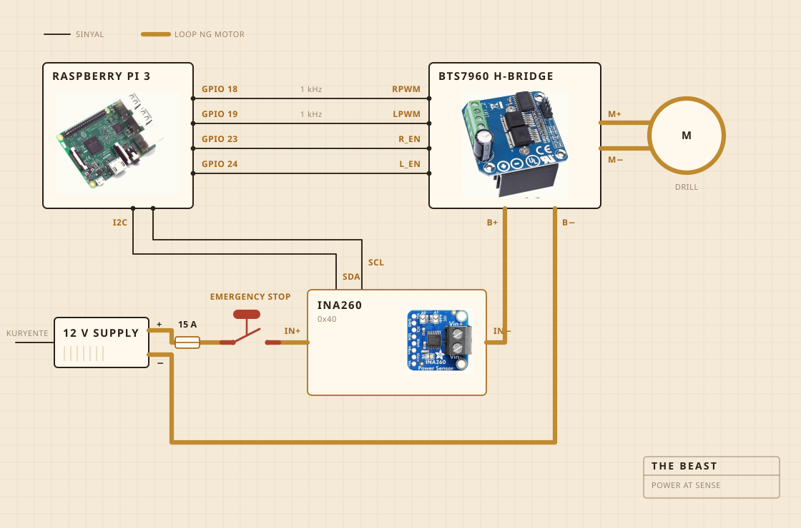

## Kung saan ito gawa

Isang cordless drill ang gumagawa ng pagpaikot. Nakaupo ito sa clamp na nabolt sa isang sangkalan, at ang sangkalan ang nagpapanatiling nakahanay ang lahat sa ibabaw ng kaldero. Ang ulo ng pambati ay matigas na kahoy sa bakal na shaft, tinurnilyo at hindi pinandikit, at iyon ang dahilan kung bakit ako gumawa kaysa bumili.

Nakatira ang electronics sa malinaw na plastik na lalagyan ng pagkain, pangunahin nang para makita ko kung may nagliyab na. Ang Raspberry Pi ang nag-aasikaso sa pagtatala. Ang malaking dilaw na pindutan ang pumapatay sa kuryente ng motor, at walang software na makapagpapawalang-bisa rito.

| Motor | Cordless drill, nakaipit, umaandar nang mas mabagal pa sa buong bilis |
| Pambati | Matigas na kahoy at stainless, ginawa hindi binili |
| Init | Hotplate, sinisindi at pinapatay ng AC regulator |
| Balangkas | Isang sangkalan at isang plastik na lalagyan ng pagkain |
| Kuryente | 12 V switch mode supply, mula sa saksakan |
| Utak | Raspberry Pi, nagtatala sa isang CSV |
| Pandama | Kuryente at boltahe habang nagbabati, isang probe sa kaldero habang nagluluto |
| Hinto | Isang malaking pindutan, nakakabit nang tuwiran |

## Kung paano ito nakakabit

Apat na signal wire at isang matabang loop. Ang Pi ang nag-iisip kung gaano kalakas at kung saang direksyon, ang H bridge ang talagang nagtutulak ng kuryente, at hindi sila nagtatagpo kahit kailan. Wala sa hinihipo ng Pi ang may dalang higit sa ilang milliamp.

Ang pindutan ang parteng sulit tingnan. Wala talaga itong kable papunta sa Pi. Nakaupo ito sa loop ng motor at pinapatid ito, kaya walang depekto sa software ang makakakumbinsi ritong huwag tumigil. Ang kaya ng Pi ay makaalam. Kung humihingi ito ng tatlumpung porsiyento at ang isinasagot ng sensor ay mas mababa pa sa dalawang daang milliamp, nalalaman nito na bukas ang loop at tumitigil na sa paghingi.

Nasa parehong loop ang sensor pero ang logic side nito ay kumukuha ng kuryente sa Pi, at iyon ang dahilan kung bakit sumasagot pa rin ito kapag patay ang supply. Iyon ang buong diskarte sa likod ng pagsusuri sa pindutan.

## Kung saan ito nakalagay

Sa ibabaw ng lababo. Ang kaldero ay inilalagay sa loob ng lababo, may patag na takip sa itaas na may butas para sa shaft, at kung may tumalsik man ay babagsak ito sa lugar na hindi mahalaga.

Ito ang parteng walang naglalagay sa render. Kalahati ng paggawa ng kahit ano sa kusina ay ang pagpapasya kung saan puwedeng mapunta ang kalat.

## Ang binabantayan nito

Habang nagbabati, ang kuryente at boltahe sa linya ng motor, kinukuha nang mga isang beses kada segundo at diretsong isinusulat sa isang file. Habang nagluluto, isang probe sa kaldero ang pumapalit, at ang regulator ang sumisindi at pumapatay sa hotplate para mahawakan ang numero.

Walang mikropono at walang kamera, at iyon ang susunod kong gustong ayusin. Ang pusta hanggang ngayon ay kung sapat na ang load mag-isa para makita ang paghiwalay, makakahintay ang iba.

## Ang ipinapasya nito

Dalawang bagay. Kung umakyat na ba at pagkatapos ay bumagsak nang sapat ang load para ideklara ang paghiwalay, at kung dapat bang sindihan o patayin ang plate para manatili sa 250 F.

Hindi nito alam kung ano ang yogurt. Hindi nito alam kung ano ang mantekilya. Alam nito na may numerong umakyat nang ilang sandali at pagkatapos ay bumagsak, at ang hugis na iyon ay nangangahulugang tapos na ang trabaho.

