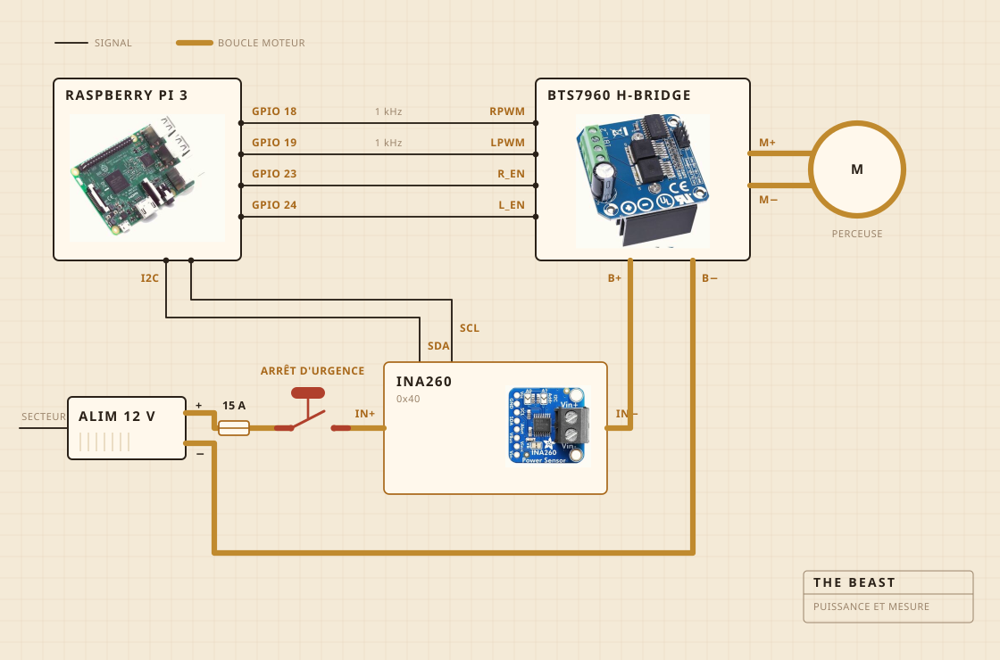

## De quoi c'est fait

C'est une perceuse sans fil qui fait tourner. Elle est tenue par un serre-joint boulonné sur une planche à découper, et c'est la planche qui garde tout bien aligné au-dessus de la casserole. La tête de baratte, c'est du bois dur sur un axe en acier, vissé plutôt que collé, et c'est justement pour ça que je l'ai faite au lieu de l'acheter.

L'électronique habite dans une boîte alimentaire en plastique transparent, surtout pour que je puisse voir si quelque chose a pris feu. Un Raspberry Pi s'occupe des relevés. Le gros bouton jaune coupe l'alimentation du moteur, et aucun logiciel n'a le droit de passer outre.

| Moteur | Perceuse sans fil, serrée dans un serre-joint, tournant bien en dessous de sa vitesse maximale |
| Baratte | Bois dur et inox, faite et non achetée |
| Chaleur | Plaque chauffante, allumée et coupée par un régulateur secteur |
| Châssis | Une planche à découper et une boîte alimentaire en plastique |
| Alimentation | Bloc à découpage 12 V, branché sur le secteur |
| Cerveau | Raspberry Pi, qui écrit dans un CSV |
| Sens | Courant et tension pendant le barattage, une sonde dans la casserole pendant la cuisson |
| Arrêt | Un gros bouton, câblé en dur |

## Comment c'est câblé

Quatre fils de signal et une grosse boucle. Le Pi calcule la force et le sens, le pont en H est ce qui pousse vraiment le courant, et les deux ne se rencontrent jamais. Rien de ce que touche le Pi ne transporte plus de quelques milliampères.

Le bouton est la partie qui vaut le coup d'œil. Il n'est pas relié au Pi du tout. Il est dans la boucle du moteur et il la coupe, donc aucun bug logiciel ne peut le convaincre de ne pas s'arrêter. Ce que le Pi peut faire, c'est s'en apercevoir. S'il demande trente pour cent et que le capteur lui renvoie moins de deux cents milliampères, il en déduit que la boucle est ouverte et il arrête de demander.

Le capteur est sur la même boucle, mais sa partie logique est alimentée par le Pi, et c'est pour ça qu'il répond encore quand l'alimentation est coupée. Toute l'astuce du test du bouton tient là.

## Où ça s'installe

Au-dessus de l'évier. La casserole va dans la cuve, un couvercle plat se pose dessus avec un trou découpé pour l'axe, et tout ce qui s'échappe tombe à un endroit où ça n'a pas d'importance.

C'est la partie que personne ne met dans le rendu 3D. Construire quelque chose dans une cuisine, c'est pour moitié décider où les saletés ont le droit d'aller.

## Ce qu'elle surveille

Pendant le barattage, le courant et la tension sur la ligne du moteur, relevés environ une fois par seconde et écrits directement dans un fichier. Pendant la cuisson, une sonde dans la casserole à la place, et le régulateur allume et coupe la plaque pour tenir le nombre.

Pas de micro et pas de caméra, et c'est la prochaine chose que je veux corriger. Le pari jusqu'ici, c'était que si la charge toute seule suffit à trouver la cassure, le reste peut attendre.

## Ce qu'elle décide

Deux choses. Si la charge est montée puis redescendue assez pour annoncer la cassure, et si la plaque doit être allumée ou coupée pour rester à 250 F.

Elle ne sait pas ce qu'est le yaourt. Elle ne sait pas ce qu'est le beurre. Elle sait qu'un nombre est monté un moment puis est retombé, et que cette forme veut dire que le travail est fini.

