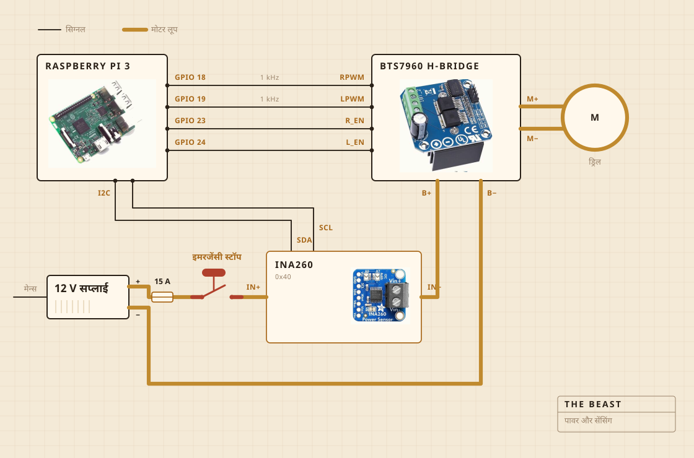

## किस चीज़ से बनी है

घुमाने का काम एक कॉर्डलेस ड्रिल करती है। वह चॉपिंग बोर्ड पर कसे क्लैंप में बैठती है, और वही बोर्ड सब कुछ बर्तन के ऊपर ठीक जगह पर टिकाए रखता है। मथनी का सिरा स्टील के डंडे पर सख़्त लकड़ी का है, गोंद से नहीं पेच से कसा। खरीदने की जगह खुद बनाने की वजह भी यही थी।

इलेक्ट्रॉनिक्स पारदर्शी प्लास्टिक के खाने के डिब्बे में रहते हैं, ज़्यादातर इसलिए कि कहीं कुछ जल तो नहीं गया यह दिख जाए। लॉग लिखने का काम रास्पबेरी पाई करता है। बड़ा पीला बटन मोटर की बिजली काट देता है, और सॉफ़्टवेयर की कोई चीज़ उसे पलट नहीं सकती।

| मोटर | कॉर्डलेस ड्रिल, क्लैंप में कसी, पूरी रफ़्तार से काफ़ी नीचे चलती |
| मथनी | सख़्त लकड़ी और स्टेनलेस स्टील, खरीदी नहीं बनाई |
| आँच | हॉटप्लेट, एसी रेगुलेटर से चालू बंद होती |
| ढाँचा | एक चॉपिंग बोर्ड और एक प्लास्टिक का खाने का डिब्बा |
| बिजली | 12 V स्विच मोड सप्लाई, दीवार के प्लग से |
| दिमाग | रास्पबेरी पाई, सीएसवी फ़ाइल में लॉग लिखता |
| इंद्रिय | मथते वक़्त करेंट और वोल्टेज, पकाते वक़्त बर्तन के अंदर की प्रोब |
| रोक | एक बड़ा बटन, सीधे तार से जुड़ा |

## कैसे जुड़ी है

चार सिग्नल तार, और एक मोटा लूप। कितने ज़ोर से और किस दिशा में, यह पाई तय करता है, करेंट असल में धकेलने का काम एच ब्रिज करता है, और ये दोनों कभी मिलते नहीं। पाई जिस किसी तार को छूता है उसमें कुछ मिलीएम्पियर से ज़्यादा नहीं बहता।

देखने लायक हिस्सा बटन है। यह पाई से जुड़ा ही नहीं है। यह मोटर के लूप में बैठता है और उसी लूप को तोड़ता है, इसलिए सॉफ़्टवेयर की कोई गड़बड़ इसे रुकने से बहला नहीं सकती। पाई जो कर सकता है वह बस जान जाना है। तीस प्रतिशत माँगते वक़्त सेंसर दो सौ मिलीएम्पियर से कम लौटाए, तो वह समझ जाता है कि लूप खुला है और माँगना छोड़ देता है।

सेंसर भी उसी लूप पर है, पर उसका लॉजिक हिस्सा पाई से चलता है। इसीलिए सप्लाई बंद रहने पर भी वह जवाब देता रहता है। बटन की जाँच के पीछे की पूरी चतुराई यही है।

## कहाँ रखी जाती है

सिंक के ऊपर। बर्तन बेसिन में जाता है, ऊपर डंडे के लिए छेद किया हुआ एक सपाट ढक्कन बैठता है, और जो कुछ छलके वह ऐसी जगह गिरता है जहाँ फ़र्क नहीं पड़ता।

यह हिस्सा कोई रेंडर में नहीं दिखाता। रसोई में कुछ बनाने का आधा काम यही तय करना होता है कि गंदगी कहाँ जाने की इजाज़त है।

## क्या देखता है

मथते वक़्त मोटर लाइन का करेंट और वोल्टेज, करीब हर सेकंड नापकर सीधे फ़ाइल में लिख देता है। पकाते वक़्त बर्तन के अंदर की प्रोब देखता है, और रेगुलेटर हॉटप्लेट को चालू बंद करके नंबर टिकाए रखता है।

माइक्रोफ़ोन नहीं, कैमरा नहीं, और अब जो ठीक करना चाहता हूँ वह यही है। अब तक का अंदाज़ा यह था कि अकेला लोड मक्खन छूटने का पल पकड़ लेता है तो बाकी चीज़ें रुक सकती हैं।

## क्या तय करता है

दो चीज़ें। लोड इतना चढ़ा और फिर इतना गिरा कि मक्खन छूट गया कहा जा सके या नहीं। और 250 F पर बैठने के लिए प्लेट चालू रहनी चाहिए या बंद।

दही क्या है, इसे नहीं पता। मक्खन क्या है, वह भी नहीं पता। इसे इतना ही पता है कि एक नंबर कुछ देर बढ़ा, फिर गिर गया, और उस आकार का मतलब है काम पूरा हुआ।

