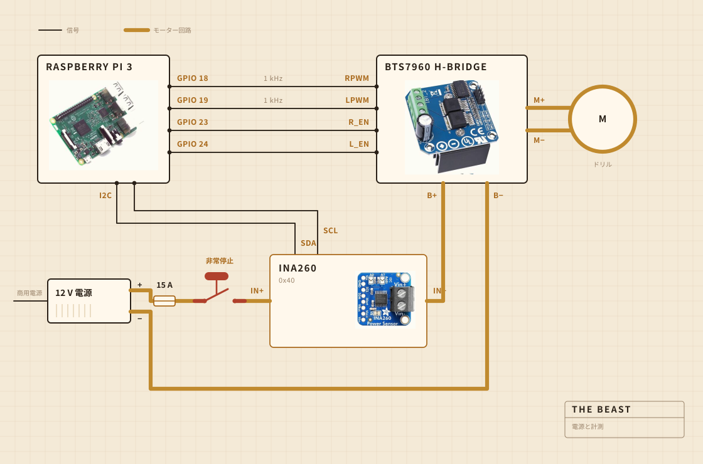

## 何でできているか

回す仕事はコードレスドリルがやっている。まな板にボルトで留めたクランプに収まっていて、鍋の上で全部の位置を揃えているのはその板だ。撹拌ヘッドはスチールシャフトに硬い木がついたもので、接着ではなくねじ留め。買わずに自分で作った理由はそこにある。

電子部品は透明なプラスチックの保存容器に住んでいる。だいたいは、何か燃えていないかを見られるようにするためだ。記録は Raspberry Pi がやっている。大きな黄色いボタンはモーターの電源を切り、ソフトウェアのどこからもそれを上書きできない。

| モーター | コードレスドリル、クランプ固定、全速よりかなり低い回転 |
| 撹拌ヘッド | 硬い木とステンレス、買わずに作った |
| 加熱 | 電熱プレート、交流の電力調整器で入り切り |
| 骨組み | まな板一枚とプラスチックの保存容器 |
| 電源 | 12 V のスイッチング電源、壁から |
| 頭脳 | Raspberry Pi、CSV に記録 |
| 感覚 | 撹拌中は電流と電圧、加熱中は鍋に入れたプローブ |
| 停止 | 大きなボタン一つ、直接配線 |

## どう配線してあるか

細い信号線が四本と、太いループが一つ。どれくらいの力でどちら向きかを決めるのは Pi で、実際に電流を押しているのは H ブリッジ。この二つは決して出会わない。Pi が触るところには、数ミリアンペアより大きい電流は流れていない。

見ておく価値があるのはボタンだ。Pi にはまったく繋がっていない。モーターのループの中に入っていて、それを切る。だからソフトウェアのどんな不具合も、止まるなと説き伏せることができない。Pi にできるのは気づくことだ。三十パーセント出せと言っているのにセンサーが二百ミリアンペア未満を返してきたら、ループが開いていると判断して、言うのをやめる。

センサーも同じループに乗っているけれど、ロジック側の電源は Pi から取っている。だから本体の電源が落ちていても返事をする。ボタンの確認の仕掛けは、全部これでできている。

## どこに置くか

シンクの上。鍋は水槽に入れて、上に平らな蓋をかぶせ、シャフトを通す穴を開けてある。飛び出したものは、どうでもいい場所に落ちる。

これは誰もレンダリングには入れない部分だ。台所で何かを作ることの半分は、汚れていい場所を決めることでできている。

## 何を見ているか

撹拌しているあいだは、モーター線の電流と電圧を一秒に一回くらい拾って、そのままファイルに書いている。加熱しているあいだは代わりに鍋に入れたプローブを見て、調整器が電熱プレートを入り切りして数字を保つ。

マイクもカメラもない。次に直したいのはそこだ。これまでの賭けは、負荷だけでバターが離れる瞬間を見つけられるなら残りは後回しでいい、というものだった。

## 何を決めているか

二つ。負荷が上がってから十分に落ちて分離と呼べるかどうか、それと 250 F にとどまるためにプレートを入れるか切るか。

ヨーグルトが何かは知らない。バターが何かも知らない。数字がしばらく上がってそれから落ちていったこと、そしてこの形が仕事が終わったという意味だということを知っている。

