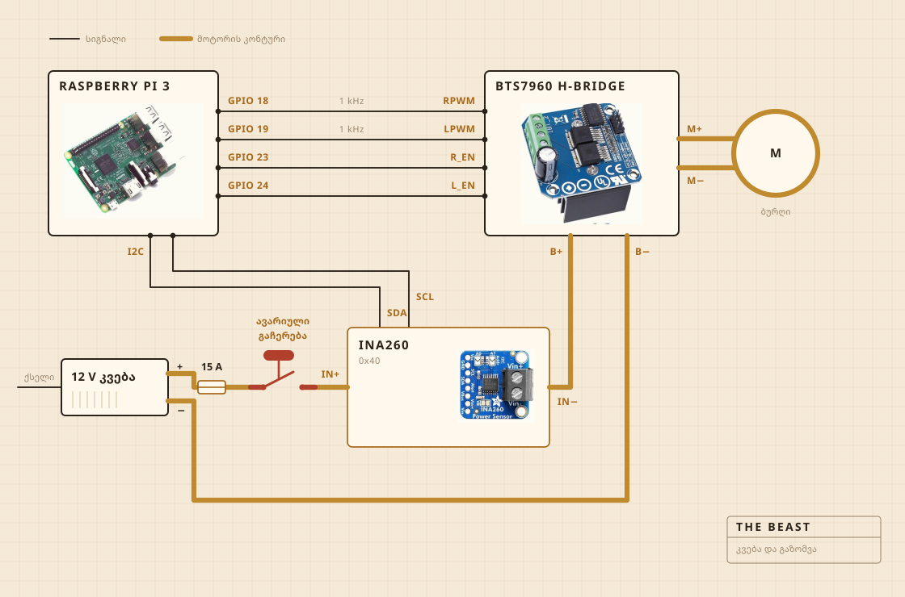

## რისგან არის აწყობილი

ტრიალს უსადენო ბურღი აკეთებს. ის სამაგრშია ჩასმული, სამაგრი კი საჭრელ დაფაზეა მიხრახნილი, და სწორედ დაფა იჭერს ყველაფერს ქვაბის თავზე გასწორებულად. სადღვებლის თავი მაგარი ხეა ფოლადის ღერძზე, ხრახნებით შეკრული და არა წებოთი, და სწორედ ამიტომ გავაკეთე და არ ვიყიდე.

ელექტრონიკა გამჭვირვალე პლასტმასის კონტეინერში ცხოვრობს, ძირითადად იმისთვის, რომ დავინახო, ხანძარი თუ არ ატყდა. ჩაწერას Raspberry Pi აკეთებს. დიდი ყვითელი ღილაკი მოტორის კვებას წყვეტს და პროგრამაში ვერაფერი შეედავება.

| მოტორი | უსადენო ბურღი სამაგრში, ბრუნები სრულზე ბევრად დაბალი |
| სადღვებელი | მაგარი ხე და უჟანგავი ფოლადი, გაკეთებული და არა ნაყიდი |
| გათბობა | ელექტროქურა, რომელსაც სიმძლავრის რეგულატორი რთავს და თიშავს |
| კარკასი | საჭრელი დაფა და პლასტმასის კონტეინერი |
| კვება | იმპულსური ბლოკი 12 V, კედლის ბუდიდან |
| ტვინი | Raspberry Pi, წერს CSV ფაილში |
| გრძნობა | დენი და ძაბვა დღვებისას, სენსორი ქვაბში ხარშვისას |
| სტოპი | ერთი დიდი ღილაკი, მყარად გაყვანილი |

## როგორ არის გაყვანილი

ოთხი სიგნალის სადენი და ერთი სქელი კონტური. Pi ითვლის, რამდენად ძლიერად და რომელ მხარეს, დენს კი სინამდვილეში H-ხიდი ამოძრავებს, და ეს ორი ერთმანეთს არასდროს ხვდება. იმაში, რასაც Pi ეხება, რამდენიმე მილიამპერზე მეტი არ გადის.

ღილაკი ის ნაწილია, რომელსაც ნამდვილად ღირს დახედვა. Pi-სთან საერთოდ არ არის შეერთებული. ის მოტორის კონტურში ზის და წყვეტს მას, ასე რომ პროგრამის ვერანაირი შეცდომა ვერ გადააფიქრებს გაჩერებას. რისი გაკეთებაც Pi-ს შეუძლია, ის არის, რომ შეამჩნიოს. თუ ის ოცდაათ პროცენტს ითხოვს, სენსორი კი ორას მილიამპერზე ნაკლებს აბრუნებს, დაასკვნის, რომ კონტური გახსნილია, და თხოვნას წყვეტს.

სენსორი იმავე კონტურზეა, მაგრამ მისი ლოგიკური ნაწილი Pi-დან იკვებება, და სწორედ ამიტომ პასუხობს მაშინაც, როცა კვება გამორთულია. ღილაკის შემოწმების მთელი ხრიკი ეს არის.

## სად დგას

ნიჟარის თავზე. ქვაბი ჩადის თასში, ზემოდან ბრტყელი საფარი ლაგდება ღერძისთვის გამოჭრილი ხვრელით, და რაც გაიჭრება, ისეთ ადგილას ვარდება, სადაც მნიშვნელობა არ აქვს.

ეს ის ნაწილია, რომელსაც რენდერში არავინ დებს. სამზარეულოში რამის აწყობის ნახევარი ის არის, რომ გადაწყვიტო, სად მისცემ ჭუჭყს უფლებას.

## რას უყურებს

დღვების დროს მოტორის ხაზზე დენსა და ძაბვას, დაახლოებით წამში ერთხელ, და პირდაპირ ფაილში. ხარშვის დროს ამის ნაცვლად ქვაბში ჩაშვებულ სენსორს, რეგულატორი კი ელექტროქურას ხან რთავს და ხან თიშავს, რომ რიცხვი შეინარჩუნოს.

მიკროფონი არა და კამერაც არა, და სწორედ ეს არის შემდეგი, რისი გასწორებაც მინდა. აქამდე ფსონი იმაზე იყო, რომ თუ მხოლოდ დატვირთვა კმარა გარდატეხის დასაჭერად, დანარჩენს ლოდინი შეუძლია.

## რას წყვეტს

ორ რამეს. აიწია თუ არა დატვირთვა და მერე ჩამოვარდა თუ არა იმდენად, რომ გარდატეხა გამოაცხადოს, და უნდა იყოს თუ არა ქურა ჩართული, რომ 250 F-ზე იდგეს.

არ იცის, რა არის მაწონი. არ იცის, რა არის კარაქი. იცის, რომ რიცხვი ცოტა ხანს ადიოდა და მერე ჩამოვარდა, და რომ ეს ფორმა იმას ნიშნავს, რომ საქმე დამთავრდა.

