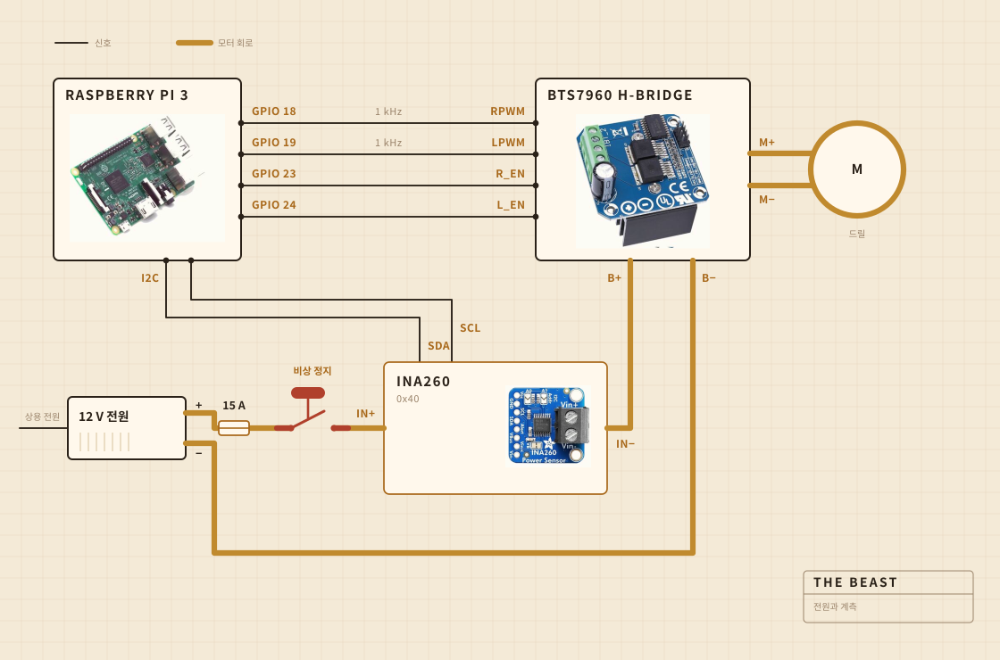

## 무엇으로 만들었는지

돌리는 일은 코드리스 드릴이 한다. 도마에 볼트로 물린 클램프에 들어가 있고, 냄비 위에서 모든 것의 위치를 잡아주는 건 그 판이다. 교반기 머리는 스틸 샤프트에 단단한 나무를 올린 것이고, 붙인 게 아니라 나사로 조였다. 사지 않고 만든 이유가 거기에 있다.

전자부품은 투명한 플라스틱 반찬통 안에 산다. 대체로는 뭔가 불이 붙었는지 볼 수 있게 하려고 그렇게 했다. 기록은 Raspberry Pi가 돌린다. 커다란 노란 버튼은 모터로 가는 전원을 끊고, 소프트웨어의 어떤 것도 그걸 덮어쓰지 못한다.

| 모터 | 코드리스 드릴, 클램프에 물려서 최고 속도보다 훨씬 낮게 |
| 교반기 | 단단한 나무와 스테인리스, 사지 않고 만든 것 |
| 열 | 핫플레이트, 교류 전력 조절기가 켜고 끈다 |
| 골격 | 도마 한 장과 플라스틱 반찬통 하나 |
| 전원 | 12 V 스위칭 전원, 벽에서 |
| 두뇌 | Raspberry Pi, CSV로 기록 |
| 감각 | 교반 중에는 전류와 전압, 가열 중에는 냄비에 꽂은 프로브 |
| 정지 | 큰 버튼 하나, 직접 배선 |

## 어떻게 배선했는지

가는 신호선 네 개와 굵은 루프 하나. 얼마나 센 힘으로 어느 방향으로 돌릴지는 Pi가 정하고, 전류를 실제로 밀어주는 것은 H 브리지이고, 이 둘은 만나지 않는다. Pi가 닿는 곳에는 몇 밀리암페어보다 큰 전류가 흐르지 않는다.

볼 만한 부분은 버튼이다. Pi에는 아예 연결되어 있지 않다. 모터 루프 안에 앉아서 그 루프를 끊는다. 그래서 어떤 소프트웨어 결함도 멈추지 말라고 설득할 수 없다. Pi가 할 수 있는 일은 알아차리는 것이다. 삼십 퍼센트를 내라고 하고 있는데 센서가 이백 밀리암페어 미만을 돌려주면, 루프가 열렸다고 판단하고 요구를 멈춘다.

센서도 같은 루프에 올라가 있지만 로직 쪽 전원은 Pi에서 받는다. 그래서 본체 전원이 꺼져 있어도 답을 한다. 버튼 확인이 되는 원리는 전부 이것으로 되어 있다.

## 어디에 놓는지

싱크대 위. 냄비는 수조 안에 들어가고 평평한 덮개가 위에 올라가며 샤프트가 지나갈 구멍이 뚫려 있다. 밖으로 튀는 것은 아무래도 상관없는 자리에 떨어진다.

이건 아무도 렌더링에는 넣지 않는 부분이다. 주방에서 뭔가 만드는 일의 절반은 지저분한 것이 어디로 가도 되는지 정하는 일로 되어 있다.

## 무엇을 보는지

교반하는 동안은 모터 선의 전류와 전압을 1초에 한 번쯤 받아서 바로 파일에 쓴다. 가열하는 동안은 대신 냄비에 꽂은 프로브를 보고, 조절기가 핫플레이트를 켜고 끄면서 숫자를 유지한다.

마이크도 카메라도 없고, 그게 다음에 고치고 싶은 것이다. 지금까지 걸어 본 판단은 부하만으로 버터가 분리되는 순간을 찾을 수 있다면 나머지는 기다려도 된다는 것이었다.

## 무엇을 판단하는지

두 가지. 부하가 올라갔다가 분리라고 부를 만큼 충분히 떨어졌는지, 그리고 250 F에 머물려면 판이 켜져 있어야 하는지 꺼져 있어야 하는지.

요구르트가 무엇인지 모른다. 버터가 무엇인지도 모른다. 어떤 숫자가 한동안 올라갔다가 떨어졌다는 것, 그리고 이 형태가 일이 끝났다는 뜻이라는 것을 안다.

