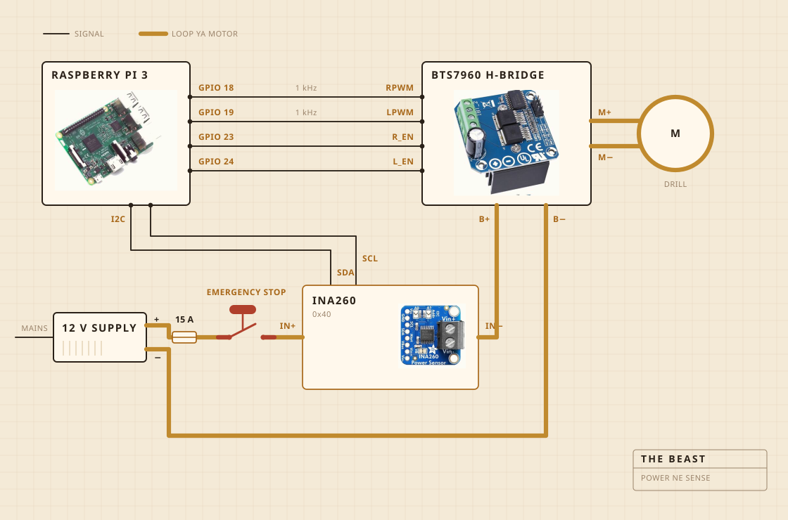

## Kyakolebwa ku ki

Cordless drill ekola omulimu gw'okwetooloosa. Etudde mu clamp enywezebbwa ku lubaawo olusalirako. Olubaawo lwe lukuuma byonna nga bisimbiddwa bulungi waggulu w'entamu. Omutwe gw'ekisundo gwa muti omukalubo ku muggo gwa stainless steel, nga gunywezebbwa sikuluvu so si gaamu. Eyo nsonga lwaki nnakikola nzennyini mu kifo ky'okukigula.

Electronics ziri mu ssanduuko ya pulasitiika entangaavu ey'okuterekamu emmere, okusinga olw'okusobola okulaba oba waliwo ekikwatidde omuliro. Raspberry Pi ye awandiika log. Ebbatani eddene erya kyenvu lisala amasannyalaze agagenda ku motor, era tewali kya software kisobola okulikyusa.

| Motor | Cordless drill, nga enywezebbwa mu clamp, era nga ekola wansi nnyo w'amaanyi gaayo gonna |
| Ekisundo | Omuti omukalubo ne stainless steel, nnakikola so saakigula |
| Ebbugumu | Hotplate, nga AC regulator egikoleeza n'egizikiza |
| Omubiri | Olubaawo olusalirako n'essanduuko ya pulasitiika |
| Amasannyalaze | 12 V switch mode supply, nga eva ku kisenge |
| Obwongo | Raspberry Pi, nga awandiika mu CSV |
| Okuwulira | Current ne voltage nga kisunda, probe mu ntamu nga kifumba |
| Okuyimiriza | Ebbatani limu eddene, nga liyungibwa butereevu |

## Engeri gye kiyungibwa

Waya nnya za signal, ne loop emu ennene ya motor. Pi ye asalawo amaanyi meka n'oludda ki, H bridge ye esindika current yennyini, era ebibiri tebituukagana. Waya yonna Pi akwatako eyitamu current entonotono nnyo.

Ekitundu ekisaanira okutunuulirwa ye bbatani. Teriyungibwa ku Pi n'akatono. Libeera mu loop ya motor, era lye lisala loop, kale tewali nsobi ya software eyinza okulisendasenda obutayimirira. Kye Pi asobola kwe kukitegeera. Bw'aba asaba ebitundu 30 ku kikumi ate sensor n'eddamu n'ekiri wansi wa 200 mA, ategeera nti loop eggule. Alekera awo okusaba.

Sensor eri ku loop y'emu, naye oludda lwayo olulowooza lufuna amasannyalaze okuva ku Pi. Kyekyo ekigireetera okuddamu ne bwe supply eba nga ezikidde. Obukodyo bwonna obw'okukebera bbatani buli mu kyo.

## Kiteekebwa wa

Waggulu wa sinki. Entamu egenda mu sinki, ekisaanikira ekitereevu ekiriko ekituli ky'omuggo kitudde waggulu, era buli kifuluma kigwa mu kifo ekitali kya nsonga.

Ekitundu kino tewali akiteeka mu bifaananyi ebirangirira. Ekitundu kimu ku bibiri eby'okuzimba ekintu mu ffumbiro kiri mu kusalawo akasasiro akakkirizibwa okugenda wa.

## Ki kye kyetegereza

Nga kisunda, current ne voltage ku layini ya motor, nga kipima omulundi gumu buli ssekonda era nga kiwandiika butereevu mu fayiro. Nga kifumba, probe mu ntamu, era regulator ekoleeza n'ezikiza hotplate okukuuma namba.

Tewali maayikolofooni, tewali kamera, era ekyo kye kyaddako okutereezebwa. Okutuusa kaakano, nnasuubira nti omugugu gwokka bwe gusobola okuzuula omuzigo lwe guvaayo, ebirala biyinza okulindirira.

## Ki kye kisalawo

Bintu bibiri. Oba omugugu gulinnye n'oluvannyuma gugudde okumala okukakasa nti omuzigo gwavuddeyo, n'oba hotplate erina kukoleezebwa oba kuzikizibwa okusigala ku 250 F.

Tekimanyi amata agakutte. Tekimanyi n'omuzigo. Ekimanyi kiri nti namba yalinnya okumala akadde, oluvannyuma n'egwa, era nti enkula eyo etegeeza nti omulimu guweze.

