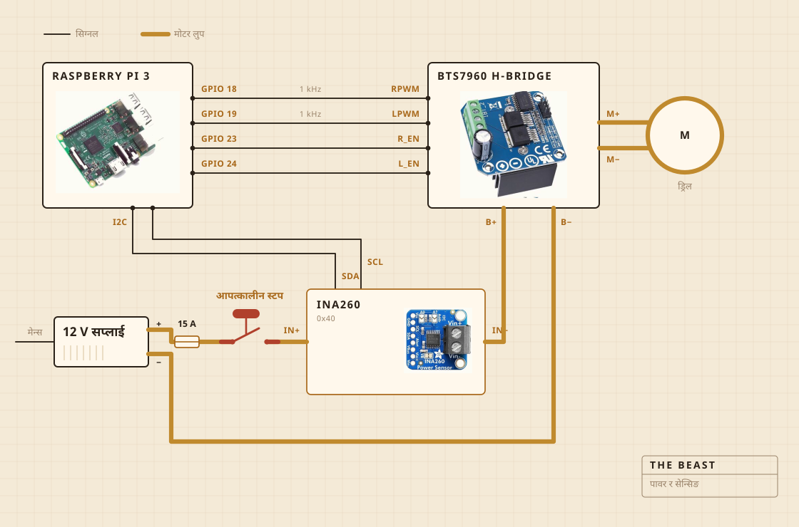

## केले बनेको छ

घुमाउने काम कर्डलेस ड्रिलले गर्छ। यो चपिङ बोर्डमा कसिएको क्ल्याम्पभित्र बस्छ, र त्यही बोर्डले सबै कुरालाई भाँडोमाथि ठीक ठाउँमा अडाइराख्छ। मदानीको टाउको स्टिलको डन्डीमा कडा काठको हो, गमले होइन पेचले कसेको। किन्नुको साटो आफैँ बनाउनुको कारण पनि त्यही हो।

इलेक्ट्रोनिक्स पारदर्शी प्लास्टिकको खानाको बाकसभित्र छन्, मुख्यतः केही आगो लाग्यो कि भनेर देख्न सकियोस् भनेर। लग लेख्ने काम रास्पबेरी पाईले गर्छ। ठूलो पहेँलो बटनले मोटरको पावर काट्छ, र सफ्टवेयरको कुनै कुराले त्यसलाई उल्ट्याउन पाउँदैन।

| मोटर | कर्डलेस ड्रिल, क्ल्याम्पमा कसिएको, पूरा गतिभन्दा धेरै तल चल्ने |
| मदानी | कडा काठ र स्टेनलेस स्टिल, किनेको होइन बनाएको |
| ताप | हटप्लेट, एसी रेगुलेटरले अन अफ गर्ने |
| फ्रेम | एउटा चपिङ बोर्ड र एउटा प्लास्टिकको खानाको बाकस |
| पावर | 12 V स्विच मोड सप्लाई, भित्ताको प्लगबाट |
| दिमाग | रास्पबेरी पाई, सीएसभी फाइलमा लग लेख्ने |
| इन्द्रिय | मोही पार्दा करेन्ट र भोल्टेज, पकाउँदा भाँडोभित्रको प्रोब |
| रोक | एउटा ठूलो बटन, सिधै तारमा जोडिएको |

## कसरी जोडिएको छ

चार वटा सिग्नल तार, र एउटा मोटो लुप। कति जोरले र कुन दिशामा भन्ने पाईले निकाल्छ, करेन्ट साँच्चै धकेल्ने काम एच ब्रिजले गर्छ, र यी दुई कहिल्यै भेटिँदैनन्। पाईले छुने कुनै पनि तारमा केही मिलिएम्पियरभन्दा बढी बग्दैन।

हेर्न लायक भाग बटन हो। यो पाईसँग जोडिएकै छैन। यो मोटरकै लुपमा बस्छ र त्यही लुप काट्छ, त्यसैले सफ्टवेयरको कुनै गडबडीले यसलाई नरोकिन फकाउन सक्दैन। पाईले गर्न सक्ने कुरा चाहिँ थाहा पाउनु हो। तीस प्रतिशत मागिरहेको बेला सेन्सरले दुई सय मिलिएम्पियरभन्दा कम फर्कायो भने, लुप खुला रहेछ भनेर बुझ्छ र माग्न छाड्छ।

सेन्सर पनि त्यही लुपमा छ, तर यसको लजिक भाग पाईबाटै चल्छ। त्यसैले सप्लाई बन्द हुँदा पनि यसले जवाफ दिइरहन्छ। बटनको जाँच पछाडिको पूरै चलाखी त्यही हो।

## कहाँ राखिन्छ

सिंकमाथि। भाँडो बेसिनभित्र जान्छ, माथि डन्डीका लागि प्वाल पारेको समथर ढकनी बस्छ, र पोखिएको जे भए पनि फरक नपर्ने ठाउँमै झर्छ।

यो भाग कसैले रेन्डरमा देखाउँदैन। भान्सामा केही बनाउने कामको आधा त फोहोर कहाँ जान पाउने भनेर निर्णय गर्नु नै हो।

## के हेर्छ

मोही पार्दा मोटर लाइनको करेन्ट र भोल्टेज, करिब सेकेन्डको एक पटक नापेर सिधै फाइलमा लेख्छ। पकाउँदा भने भाँडोभित्रको प्रोब हेर्छ, र रेगुलेटरले हटप्लेट अन अफ गर्दै नम्बर टिकाउँछ।

माइक्रोफोन छैन, क्यामेरा छैन, र अब सुधार्न खोजेको कुरा पनि त्यही हो। अहिलेसम्मको अड्कल यस्तो थियो। लोड एक्लैले नौनी छुट्टिएको क्षण भेट्टाउँछ भने बाँकी कुरा पर्खे पनि हुन्छ।

## के निर्णय गर्छ

दुई कुरा। लोड कति चढेर कति घट्यो, नौनी छुट्टियो भन्न पुग्छ कि पुग्दैन। अनि 250 F मा बस्न प्लेट अन हुनुपर्छ कि अफ।

दही के हो, यसलाई थाहा छैन। नौनी के हो, त्यो पनि थाहा छैन। यसलाई थाहा भएको कुरा यत्ति हो। एउटा नम्बर केही बेर बढ्यो, अनि घट्यो, र त्यो आकारको अर्थ काम सकियो भन्ने हो।
