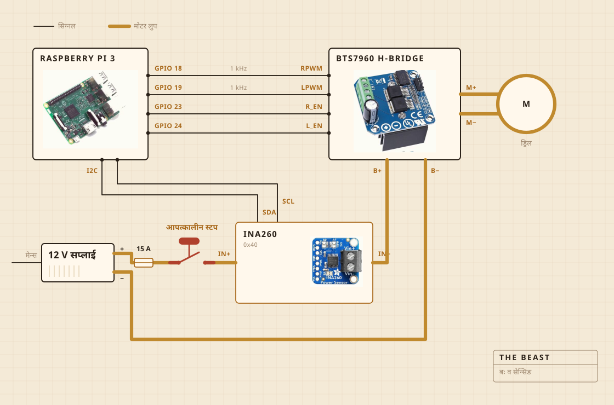

## गुकिं दय्कातःगु खः

न्ह्याकेगु ज्या कर्डलेस ड्रिलं याइ। व चपिङ बोर्डय् कसातःगु क्ल्याम्पय् च्वनी, अले थलया च्वय् फुक्कं ठीक थासय् ज्वनातइगु व हे बोर्ड खः। मदानीया छ्यं नँया डन्डीइ क्वातुगु सिँ खः, गमं त्वपुयागु मखु पेचं कसागु। न्यायेगुया थासय् थःम्हं दय्कागु कारण नं व हे खः।

इलेक्ट्रोनिक्स यचुगु प्लास्टिकया नसा तयेगु बाकसय् दु। छुं मि च्यात ला धकाः स्वये फयेमा धइगु हे मू कारण खः। लग च्वयेगु ज्या रास्पबेरी पाईं याइ। तःधंगु म्हासुगु बटनं मोटरया बः दिकी, अले सफ्टवेयरया छुं नं खँनं थ्वयात त्वथुले मफु।

| मोटर | कर्डलेस ड्रिल, क्ल्याम्पय् कसातःगु, पूवंगु गति स्वयाः तसकं क्वय् न्ह्यानाच्वंगु |
| मदानी | क्वातुगु सिँ व स्टेनलेस स्टिल, न्याःगु मखु दय्कागु |
| ताप | हटप्लेट, एसी रेगुलेटरं अन अफ याइगु |
| फ्रेम | छगू चपिङ बोर्ड व छगू प्लास्टिकया नसा तयेगु बाकस |
| बः | 12 V स्विच मोड सप्लाई, मेन्सपाखें |
| नुगः | रास्पबेरी पाई, CSV फाइलय् लग च्वयाच्वनीगु |
| इन्द्रिय | थायेबलय् करेन्ट व भोल्टेज, थुइबलय् थल दुनेया प्रोब |
| दिकेगु | छगू तःधंगु बटन, सिधै तारं कसातःगु |

## तार गथे कसातःगु खः

प्यंगू सिग्नल तार, अले छगू तःजिगु लुप। गुलि जोरं अले गुगु खेपाखे धकाः पाईं सीकी, करेन्ट धात्थें छ्वयेगु ज्या एच ब्रिजं याइ, अले थुपिं निगू गुबलें नापलाइमखु। पाईं थीगु छुं नं तारय् गुलिं मिलिएम्पियर स्वयाः अप्वः मवइ।

स्वयेगु मू दुगु ब्व धाःसा बटन खः। थ्व पाईनाप कसातःगु हे मखु। थ्व मोटरयागु हे लुपय् च्वनी अले उगु लुप पाय्की, उकिं सफ्टवेयरया छुं नं गल्तीं थुकियात मदिकेत फुस्लाये मफु। पाईं याये फुगु खँ धाःसा सीकेगु जक खः। सुइ प्रतिशत फ्वनाच्वंगु इलय् सेन्सरं निसः मिलिएम्पियर स्वयाः म्हो लिसः बिल धाःसा, लुप चायाच्वंगु दु धकाः थुइकी अले फ्वनेगु त्वःती।

सेन्सर नं उगु हे लुपय् दु, तर थुकिया लजिक ब्व पाईपाखें हे न्ह्याइ। उकिं सप्लाई अफ जूबलय् नं थ्व लिसः बियाच्वनी। बटन जाँच यायेगु लिउनेया पूवंगु चलाखी व हे खः।

## गन च्वनी

सिंकया च्वय्। थल बेसिन दुने वनी, च्वय् डन्डीया निंतिं प्वाः खनातःगु सिधागु देवः च्वनी, अले पिहां वंगु छुं नं पाः मवइगु थासय् हे कुतुं वनी।

थ्व ब्व सुनां नं रेन्डरय् तइमखु। भुतूइ छुं दय्केगु ज्याया बछि धाःसा फ्वहर गन वने ज्यू धकाः निर्णय यायेगु हे खः।

## छु स्वयाच्वनी

थायाच्वंबलय् मोटर लाइनया करेन्ट व भोल्टेज, करिब सेकेन्डय् छक्वः नापतौ यानाः सिधै छगू फाइलय् च्वयी। थुयाच्वंबलय् धाःसा थल दुनेया प्रोब, अले रेगुलेटरं हटप्लेट अन अफ यानाः ल्याः ज्वनातइ।

माइक्रोफोन मदु, किपासा नं मदु, अले आः थ्व हे खँ ठीक यायेगु मन दु। आः तकया अनुमान थ्व खः। मख्खन पिहां वइगु ई लोडं थःम्हं हे मालेत गाइ धाःसा ल्यंगु खँत पिये नं दइ।

## छु निर्णय याइ

निगू खँ। लोड गुलि च्वय् वन अले गुलि कुतुं वन, मख्खन पिहां वल धाये गाइ ला मगाइ ला। अले 250 F य् च्वनेत प्लेट अन जुइमाः ला अफ जुइमाः ला।

धौ छु खः, थुकिं मस्यू। मख्खन छु खः, व नं मस्यू। थुकिं स्यूगु खँ थ्वति जक खः। छगू ल्याः छगू इलय् तक च्वय् वन, अनंलि कुतुं वन, अले उगु आकारया अर्थ ज्या क्वचाल धइगु खः।

