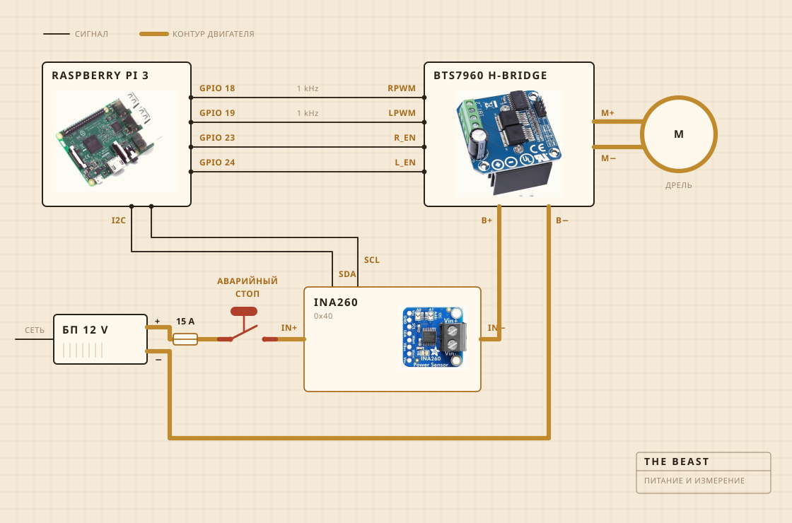

## Из чего она собрана

Крутит аккумуляторная дрель. Она сидит в зажиме, прикрученном к разделочной доске, и именно доска держит всё выстроенным над кастрюлей. Головка мутовки это твёрдое дерево на стальном валу, собранное на винтах, а не на клею, и именно поэтому я сделал её, а не купил.

Электроника живёт в прозрачном пластиковом контейнере, в основном чтобы я видел, не загорелось ли что-нибудь. Записью занимается Raspberry Pi. Большая жёлтая кнопка разрывает питание мотора, и ничто в софте не может её переспорить.

| Мотор | Аккумуляторная дрель в зажиме, обороты сильно ниже полных |
| Мутовка | Твёрдое дерево и нержавейка, сделана, а не куплена |
| Нагрев | Плитка, которую регулятор мощности включает и выключает |
| Каркас | Разделочная доска и пластиковый контейнер |
| Питание | Импульсный блок 12 V, из розетки |
| Мозг | Raspberry Pi, пишет в CSV |
| Чувство | Ток и напряжение при сбивании, датчик в кастрюле при вытапливании |
| Стоп | Одна большая кнопка, жёстко в проводах |

## Как она собрана по схеме

Четыре сигнальных провода и один толстый контур. Pi считает, насколько сильно и в какую сторону, ток на самом деле толкает H-мост, и эти двое никогда не встречаются. Через то, чего касается Pi, не идёт больше нескольких миллиампер.

Кнопка это та часть, на которую стоит посмотреть. Она вообще не подключена к Pi. Она стоит в контуре мотора и разрывает его, так что никакой сбой в софте не отговорит её остановиться. Что Pi может, так это заметить. Если он просит тридцать процентов, а датчик возвращает меньше двухсот миллиампер, он делает вывод, что контур разомкнут, и перестаёт просить.

Датчик стоит в том же контуре, но его логическая часть питается от Pi, и поэтому он отвечает даже тогда, когда питание снято. В этом весь фокус проверки кнопки.

## Где она стоит

Над раковиной. Кастрюля идёт в чашу, сверху ложится плоская крышка с прорезанным отверстием под вал, и всё, что сбегает, попадает туда, где это не важно.

Это та часть, которую никто не кладёт в рендер. Половина работы, когда собираешь что-то на кухне, уходит на решение о том, куда разрешено деваться беспорядку.

## За чем она следит

Пока идёт сбивание, за током и напряжением на линии мотора, примерно раз в секунду, и прямо в файл. Пока идёт вытапливание, вместо этого за датчиком в кастрюле, а регулятор то включает плитку, то выключает, чтобы держать число.

Ни микрофона, ни камеры, и это следующее, что я хочу исправить. Ставка до сих пор была в том, что если одной нагрузки хватает, чтобы найти перелом, остальное может подождать.

## Что она решает

Две вещи. Поднялась ли нагрузка и упала ли потом достаточно, чтобы объявить перелом, и должна ли плитка быть включена или выключена, чтобы стоять на 250 F.

Она не знает, что такое йогурт. Она не знает, что такое масло. Она знает, что число какое-то время росло, а потом ушло вниз, и что эта форма означает, что работа закончена.

