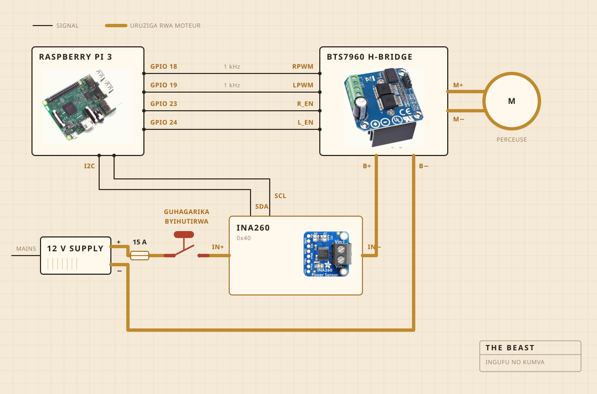

## Ibyo igizwemo

Perceuse ya batiri ni yo izunguza. Ifatirijwe ku rubaho rw'igikoni, kandi urwo rubaho ni rwo rugumisha byose ku murongo hejuru y'inkono. Umutwe w'igicundo ni ibiti bikomeye ku cyuma, bifatanye vis atari ibomo. Ni na yo mpamvu nagikoze aho kugura igiteguye.

Électronique ibamo mu gasanduku ka plastiki ibonerana k'ibiryo, ahanini ngo mbone niba hari ikintu cyafashe umuriro. Raspberry Pi ni yo yandika log. Buto nini y'umuhondo ica amashanyarazi ya moteur, kandi nta kintu cyo mu logiciel gishobora kubihindura.

| Moteur | Perceuse ya batiri, ifatirijwe, igenda munsi cyane y'umuvuduko wayo wose |
| Igicundo | Ibiti bikomeye na inox, byakozwe atari byaguzwe |
| Ubushyuhe | Réchaud, icanwa kandi izimywa na régulateur ya AC |
| Umugongo | Urubaho rw'igikoni n'agasanduku ka plastiki k'ibiryo |
| Amashanyarazi | Alimentation ya 12 V yo mu bwoko bwa switch mode, ivuye ku rukuta |
| Ubwonko | Raspberry Pi, yandika mu dosiye ya CSV |
| Kumva | Courant na voltage mu gucunda, sonde mu nkono mu guteka |
| Guhagarika | Buto imwe nini, ihujwe n'insinga gusa |

## Uko ihujwe

Insinga enye za signal, n'uruziga rumwe runini. Pi ni yo ibara ingufu n'icyerekezo, pont H ni yo isunika courant koko, kandi ibyo byombi ntibihura na rimwe. Nta nsinga Pi ikoraho itwara courant irenga milliampères nkeya.

Igice gikwiye kurebwa ni buto. Ntabwo ihujwe na Pi na gato. Iba mu ruziga rwa moteur kandi ni yo irucamo, bityo nta kosa ryo mu logiciel rishobora kubuza imashini guhagarara. Icyo Pi ishobora ni kubimenya. Niba isaba mirongo itatu ku ijana naho capteur yerekana munsi ya milliampères magana abiri, Pi ibona ko uruziga rufunguye, igahagarika gusaba.

Capteur iri kuri urwo ruziga rumwe, ariko uruhande rwayo rw'ubwenge rukoresha amashanyarazi ya Pi. Ni yo mpamvu igumya kwitaba n'ubwo alimentation yazimye. Ubwo ni bwo bwenge bwose buri inyuma y'isuzuma rya buto.

## Aho ishyirwa

Hejuru ya lavabo. Inkono ijya imbere mu lavabo, hejuru hashyirwa ipfundikizo ritambitse ryacukuwemo umwobo icyuma kinyuramo, kandi ikintu cyose cyasohoka kigwa ahantu bidateye ikibazo.

Iki ni igice ntawe ushyira mu bishushanyo byiza. Kimwe cya kabiri cyo kubaka ikintu mu gikoni ni ugufata icyemezo cy'aho umwanda wemerewe kujya.

## Icyo ireba

Igihe icunda, courant na voltage ku murongo wa moteur, bipimwa nk'inshuro imwe kuri segonda bikandikwa ako kanya mu dosiye. Igihe iteka, ni sonde iri mu nkono, naho régulateur ica réchaud ikayigarura ngo umubare ugume uko uri.

Nta micro, nta caméra, kandi ni cyo kintu cya mbere nshaka kuzuza. Icyo nizeraga kugeza ubu ni iki. Niba charge yonyine ihagije mu kubona igihe amavuta acika, ibindi birashobora gutegereza.

## Icyo yemeza

Ibintu bibiri. Niba charge yazamutse hanyuma yagwa bihagije ngo ivuge ko amavuta yacitse, na niba réchaud igomba kuba icanye cyangwa yazimye ngo igume kuri 250 F.

Ntizi icyo ikivuguto ari cyo. Ntizi icyo amavuta ari yo. Icyo izi ni iki. Umubare wazamutse akanya hanyuma uragwa, kandi iyo shusho isobanura ko akazi karangiye.

