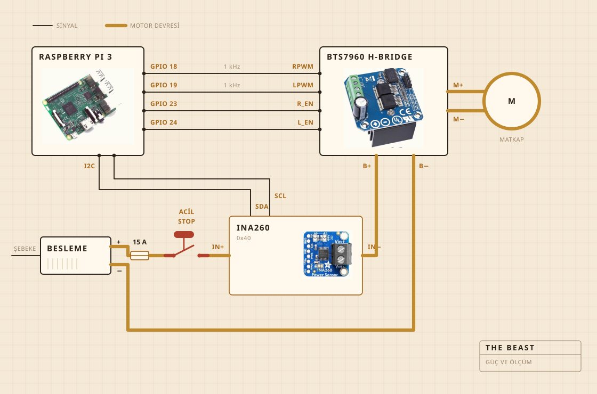

## Nelerden yapıldığı

Çevirme işini akülü bir matkap yapıyor. Kesme tahtasına vidalanmış bir mengenenin içinde duruyor, tahta da her şeyi tencerenin üzerinde hizada tutan parça. Yayık kafası çelik bir mil üzerinde sert ahşap, tutkalla değil vidayla birleştirildi, onu satın almak yerine kendim yapmamın sebebi de tam olarak bu.

Elektronik şeffaf plastik bir saklama kabının içinde yaşıyor, çoğunlukla bir şeyin alev alıp almadığını görebilmem için. Kaydı bir Raspberry Pi tutuyor. Büyük sarı düğme motora giden akımı kesiyor ve yazılımdaki hiçbir şey onu geçersiz kılamıyor.

| Motor | Akülü matkap, mengeneli, tam hızın çok altında çalışıyor |
| Yayık | Sert ahşap ve paslanmaz çelik, satın alınmadı yapıldı |
| Isı | Elektrikli ocak, bir güç regülatörüyle açılıp kapanıyor |
| İskelet | Bir kesme tahtası ve bir plastik saklama kabı |
| Güç | 12 V anahtarlamalı güç kaynağı, prizden |
| Beyin | Raspberry Pi, bir CSV dosyasına kaydediyor |
| Algı | Yayıklamada akım ve gerilim, pişirmede tencerede bir sonda |
| Durdurma | Tek büyük düğme, sabit kablolu |

## Nasıl bağlandığı

Dört sinyal kablosu ve bir kalın güç devresi. Pi ne kadar sert ve hangi yöne diye hesaplıyor, akımı gerçekte iten şey H köprüsü. İkisi hiç buluşmuyor. Pi'nin dokunduğu hiçbir şey birkaç miliamperden fazlasını taşımıyor.

Düğme bakmaya değer parça. Pi'ye hiç bağlı değil. Motor devresinin üzerinde duruyor ve devreyi kesiyor, yani hiçbir yazılım hatası onu durmamaya ikna edemiyor. Pi'nin yapabildiği şey bunu fark etmek. Yüzde otuz istiyorsa ve sensörden iki yüz miliamperden azı dönüyorsa, devrenin açık olduğunu anlayıp istemeyi bırakıyor.

Sensör aynı devrenin üzerinde ama mantık tarafı Pi'den besleniyor, kaynak kapalıyken bile cevap vermesinin sebebi bu. Düğme kontrolünün arkasındaki bütün numara da bu.

## Nerede durduğu

Lavabonun üstünde. Tencere gözün içine giriyor, üstüne mil için delik açılmış düz bir kapak oturuyor, kaçan her şey de önemsiz bir yere düşüyor.

Bu, kimsenin görsele koymadığı kısım. Bir mutfakta bir şey yapmanın yarısı, pisliğin nereye gitmesine izin verildiğine karar vermek.

## Neyi izlediği

Yayıklarken motor hattındaki akım ve gerilim, saniyede bir kez örneklenip doğrudan bir dosyaya yazılıyor. Pişirirken onun yerine tencerede bir sonda var, regülatör de sayıyı tutmak için ocağı devreye alıp çıkarıyor.

Mikrofon yok, kamera yok. Düzeltmek istediğim ilk şey de bu. Şimdiye kadarki bahis şuydu, yük tek başına kopmayı bulmaya yetiyorsa gerisi bekleyebilir.

## Neye karar verdiği

İki şey. Yükün kopmayı ilan etmeye yetecek kadar yükselip sonra düşüp düşmediği. Bir de plakanın 250 F'de kalmak için açık mı kapalı mı olması gerektiği.

Yoğurdun ne olduğunu bilmiyor. Tereyağının ne olduğunu bilmiyor. Bir sayının bir süre yükseldiğini sonra geri düştüğünü biliyor. Bu biçimin işin bittiği anlamına geldiğini de biliyor.

