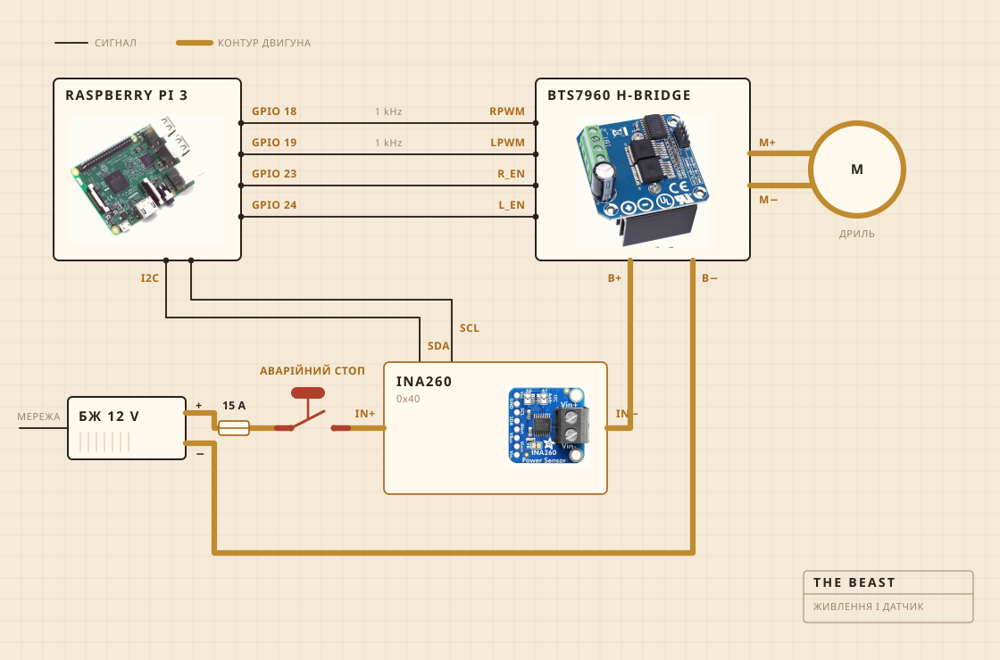

## З чого вона зібрана

Крутить акумуляторний дриль. Він сидить у затискачі, прикрученому до кухонної дошки, і саме дошка тримає все вивіреним над каструлею. Головка колотівки це тверда деревина на сталевому валу, зібрана на гвинтах, а не на клею, і саме тому я зробив її, а не купив.

Електроніка живе в прозорому пластиковому контейнері, в основному щоб я бачив, чи не загорілося щось. Записом займається Raspberry Pi. Велика жовта кнопка розриває живлення мотора, і ніщо в софті не може цього скасувати.

| Мотор | Акумуляторний дриль у затискачі, обороти значно нижчі за повні |
| Колотівка | Тверда деревина та нержавна сталь, зроблена, а не куплена |
| Нагрів | Плитка, яку регулятор потужності вмикає і вимикає |
| Каркас | Кухонна дошка та пластиковий контейнер |
| Живлення | Імпульсний блок 12 V, з розетки |
| Мозок | Raspberry Pi, пише у CSV |
| Відчуття | Струм і напруга при збиванні, датчик у каструлі при витоплюванні |
| Стоп | Одна велика кнопка, жорстко в проводах |

## Як вона з’єднана

Чотири сигнальні проводи і один товстий контур. Pi рахує, наскільки сильно і в який бік, струм насправді штовхає H-міст, і ці двоє ніколи не зустрічаються. Через те, чого торкається Pi, не йде більше кількох міліампер.

Кнопка це та частина, на яку варто подивитися. Вона взагалі не підключена до Pi. Вона стоїть у контурі мотора і розриває його, тож жоден збій у софті не відмовить її від зупинки. Що Pi може, так це помітити. Якщо він просить тридцять відсотків, а датчик повертає менше двохсот міліампер, він робить висновок, що контур розімкнений, і перестає просити.

Датчик стоїть у тому самому контурі, але його логічна частина живиться від Pi, і тому він відповідає навіть тоді, коли живлення зняте. У цьому весь фокус перевірки кнопки.

## Де вона стоїть

Над мийкою. Каструля йде в чашу, згори лягає плоска накривка з прорізаним отвором під вал, і все, що тікає, попадає туди, де це не важливо.

Це та частина, яку ніхто не кладе в рендер. Половина роботи, коли збираєш щось на кухні, іде на рішення про те, куди дозволено дітися безладу.

## За чим вона слідкує

Поки йде збивання, за струмом і напругою на лінії мотора, приблизно раз на секунду, і прямо у файл. Поки йде витоплювання, замість цього за датчиком у каструлі, а регулятор то вмикає плитку, то вимикає, щоб тримати число.

Ні мікрофона, ні камери, і це наступне, що я хочу виправити. Ставка досі була в тому, що якщо одного навантаження досить, щоб знайти злам, решта може почекати.

## Що вона вирішує

Дві речі. Чи піднялося навантаження і чи впало потім достатньо, щоб оголосити злам, і чи має плитка бути ввімкнена або вимкнена, щоб стояти на 250 F.

Вона не знає, що таке кисляк. Вона не знає, що таке масло. Вона знає, що число якийсь час росло, а потім пішло вниз, і що ця форма означає, що робота закінчена.

