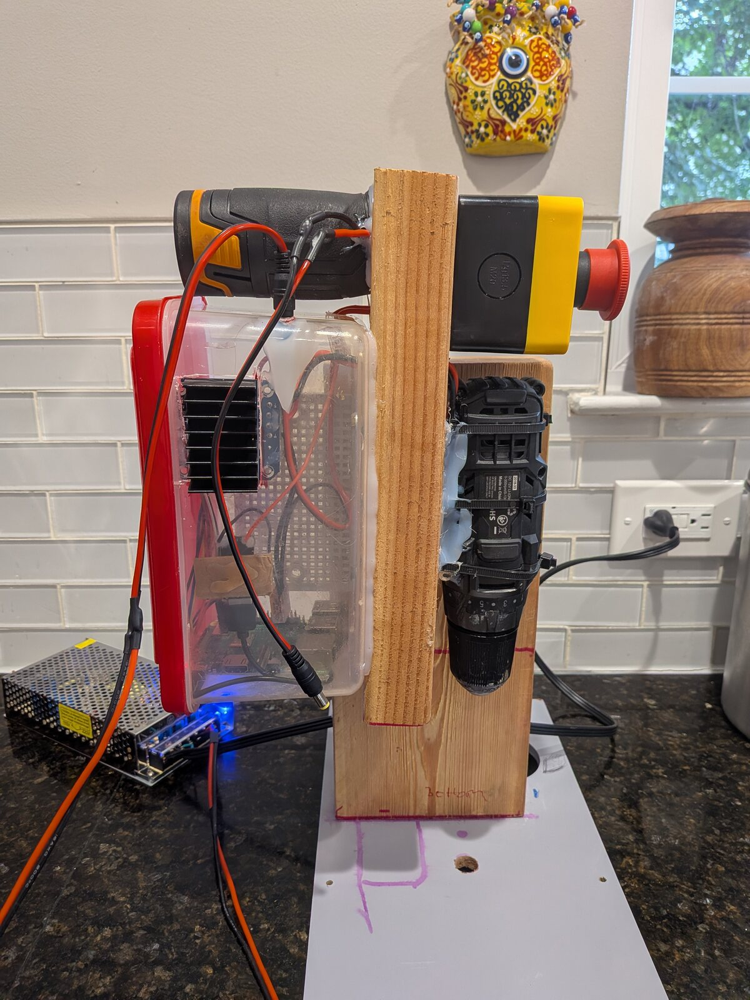
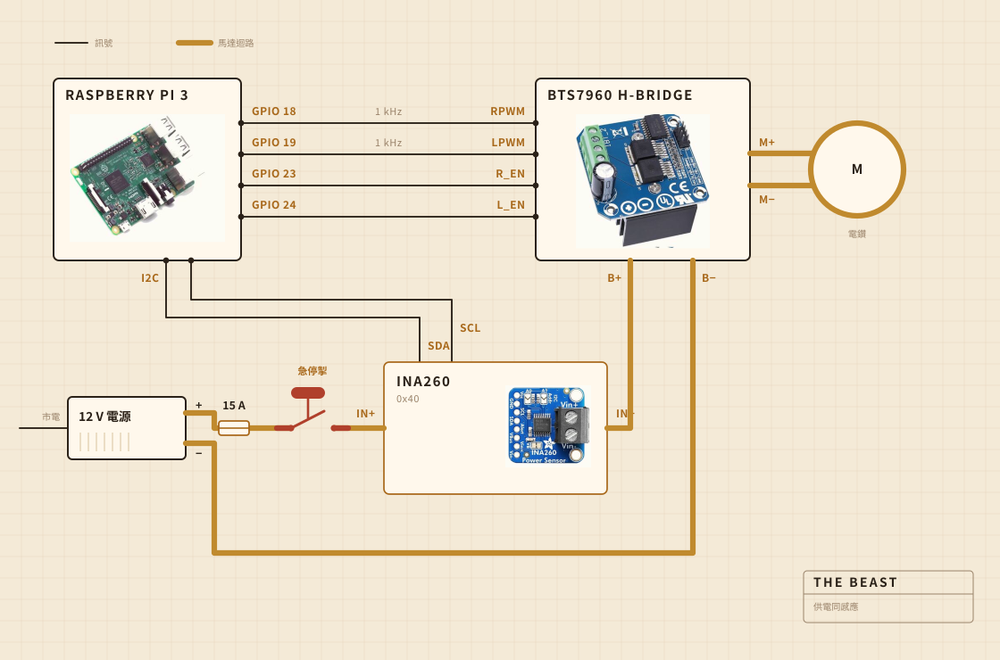
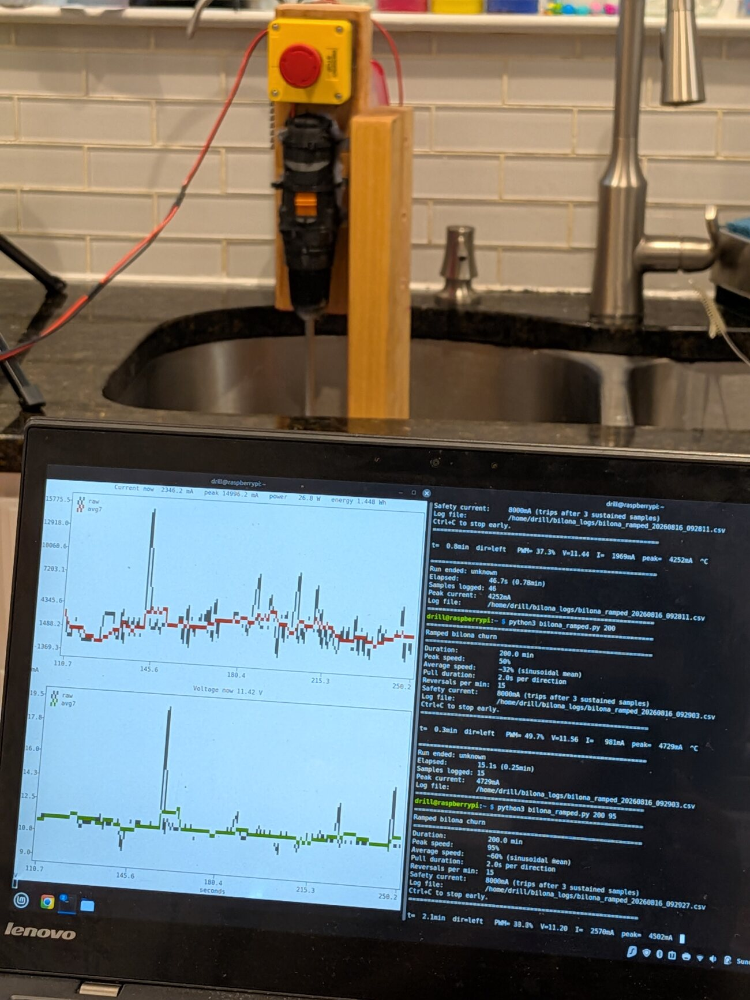
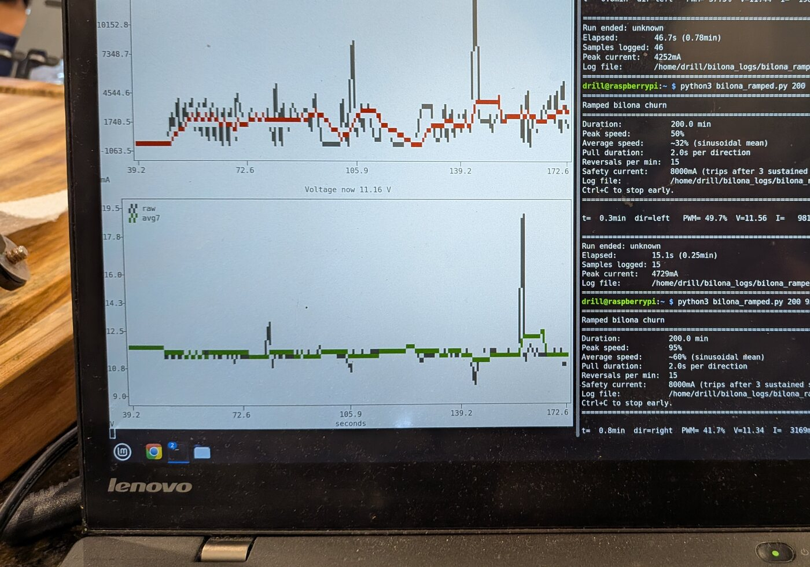
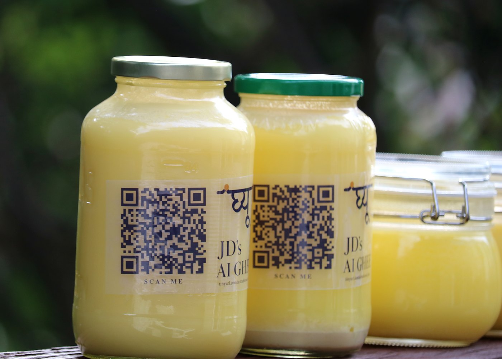

## 佢用乜砌成

轉嘅工由一把充電電鑽做。佢夾喺一個夾鉗入面，夾鉗用螺絲上喺一塊砧板上，而就係呢塊板令到所有嘢喺鍋上面對得正，唔會喐。攪棒頭係裝喺鋼軸上嘅硬木，用螺絲擰埋而唔係用膠黏，我自己做而唔係買現成，原因就喺呢度。

電子嘢住喺一個透明塑膠食物盒入面，主要係為咗畀我睇得到有冇邊樣燒起。記錄由一部 Raspberry Pi 負責。嗰個大大嘅黃掣切斷馬達嘅電，而軟件入面冇任何嘢可以駁佢嘴。

| 馬達 | 充電電鑽，夾鉗夾住，轉速遠低過全速 |
| 攪棒 | 硬木同不鏽鋼，自己做，唔係買 |
| 加熱 | 電爐，由 AC 調壓器開開關關 |
| 骨架 | 一塊砧板同一個塑膠食物盒 |
| 供電 | 12 V 開關電源，插牆 |
| 腦 | Raspberry Pi，寫入一個 CSV |
| 感覺 | 攪嗰陣睇電流同電壓，煮嗰陣睇鍋入面嘅探針 |
| 停 | 一個大掣，硬線接死 |

## 佢點接線

四條訊號線，一個粗迴路。Pi 計出要幾大力、向邊邊轉，真正將電流推出去嘅係 H 橋，而兩邊從來唔會相撞。Pi 掂到嘅任何一處，電流都唔會超過幾毫安。

個掣至係值得睇嘅部件。佢根本冇接去 Pi。佢串喺馬達迴路入面，斷開嘅就係呢個迴路，所以冇任何軟件出錯可以勸佢唔好停。Pi 做得到嘅係察覺。如果佢要三成輸出，而感應器回報嘅電流唔夠兩百毫安，佢就推斷迴路斷咗，於是唔再要。

感應器都喺同一個迴路上，但佢嘅邏輯側係靠 Pi 供電，所以就算主電源斷咗，佢照樣回話。成個掣檢測嘅竅門就喺呢度。

## 佢擺喺邊

水槽上面。個鍋放入槽入面，上面蓋一塊平板，板上開咗個窿畀支軸過，走出嚟嘅嘢都跌落一個唔緊要嘅地方。

呢部分冇人會放入效果圖。喺廚房砌嘢，一半功夫都係用嚟決定啲污糟嘢可以去邊。

## 佢盯住乜

攪嘅時候，盯嘅係馬達線上嘅電流同電壓，大約每秒取樣一次，直接寫入一個檔案。煮嘅時候就換成鍋入面一支探針，調壓器將電爐開開關關，為咗守住個數字。

冇咪，又冇鏡頭，而呢樣正係我下一步想補返嘅。到目前為止賭嘅係，只要單靠負載就夠搵到散開嗰一刻，其餘嘅可以再等。

## 佢決定乜

兩樣。負載係唔係升夠咗又跌夠咗，可以判定牛油散開，以及電爐要開定要關，個數字至守得住 250 F。

佢唔知乳酪係乜。佢唔知牛油係乜。佢只知有一個數字升咗一陣，然後跌返落去，而呢個形狀代表份工做完。

