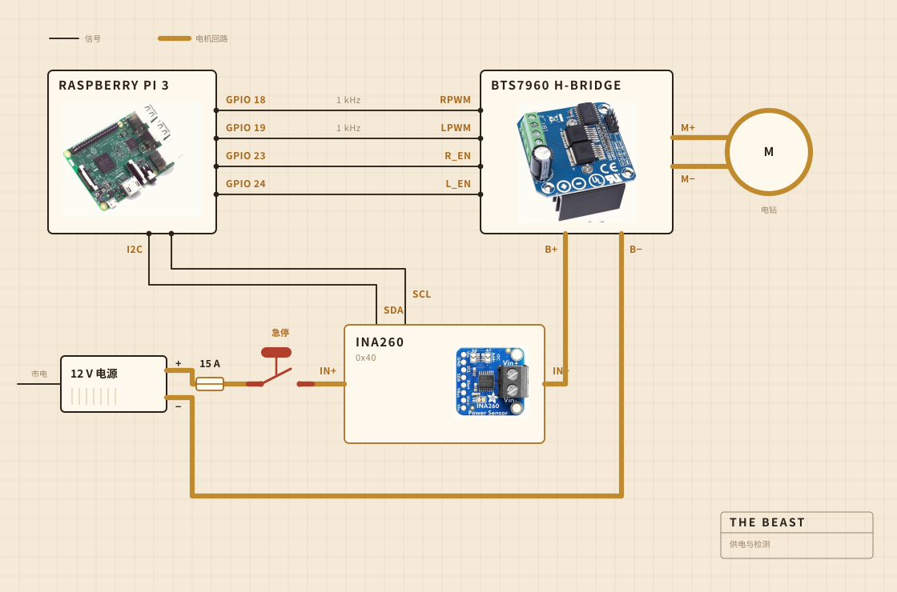

## 它由什么组成

转动的活由一把充电电钻来做。它卡在一个夹具里，夹具拧在一块砧板上，而这块板子就是让所有东西在锅上方对齐的东西。搅拌头是装在钢杆上的硬木，用螺丝拧起来而不是粘起来，我自己做而不是买现成的，原因正在这里。

电子件住在一个透明的保鲜盒里，主要是为了让我能看见有没有什么东西烧起来。记录由一台树莓派负责。那个大大的黄色按钮切断电机的电源，而且软件里没有任何东西能推翻它。

| 电机 | 充电电钻，卡在夹具里，转速远低于全速 |
| 搅拌头 | 硬木和不锈钢，自己做的，不是买的 |
| 加热 | 电热板，由调功器通断控制 |
| 骨架 | 一块砧板和一个塑料保鲜盒 |
| 供电 | 12 V 开关电源，接市电 |
| 大脑 | 树莓派，写进一个 CSV 文件 |
| 感觉 | 搅拌时看电流和电压，熬制时看锅里的探头 |
| 停止 | 一个大按钮，硬接线 |

## 它怎么接线

四根信号线和一个粗回路。树莓派算出要多大力、往哪个方向转，真正把电流推出去的是 H 桥，而这两者从不相接。树莓派碰到的任何地方，电流都不超过几毫安。

那个按钮才是值得看的部件。它根本没有接到树莓派上。它串在电机回路里，断开的就是这个回路，所以没有任何软件故障能劝它不要停。树莓派能做的是察觉。如果它要求三成的输出，而传感器回报的电流不到两百毫安，它就推断出回路断了，于是不再要求。

传感器也在同一个回路上，但它的逻辑侧由树莓派供电，所以即使主电源断了它照样回话。整个按钮检测的窍门就在这里。

## 它放在哪里

水槽上方。锅放进槽里，上面盖一块平板，板上开了一个过杆子的洞，跑出来的东西都落在无所谓的地方。

这是没人会放进效果图里的那一部分。在厨房里做东西，一半的功夫花在决定脏乱可以去哪里。

## 它在盯着什么

搅拌的时候，盯的是电机线上的电流和电压，大约每秒采一次，直接写进文件。熬制的时候换成锅里的一支探头，调功器把电热板不断接上又断开，好把数字守住。

没有麦克风，也没有摄像头，这正是我接下来想补上的。到目前为止赌的是，只要负载本身足够找到破乳的那一刻，其余的就可以再等等。

## 它决定什么

两件事。负载是不是升够了又掉够了，可以宣布破乳，以及电热板该开还是该关，才能停在 250 F。

它不知道酸奶是什么。它不知道黄油是什么。它只知道有一个数字升了一阵又落了下去，而这个形状意味着活干完了。

