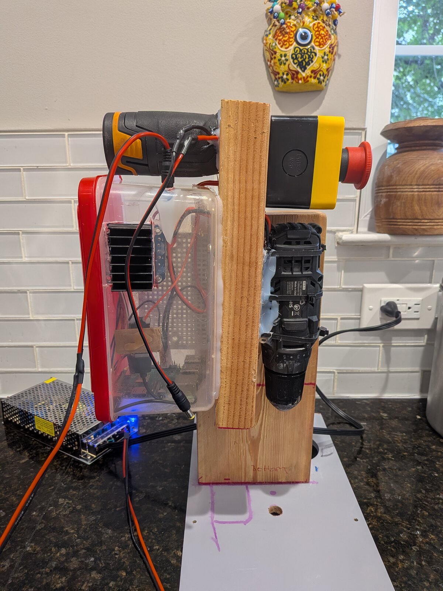
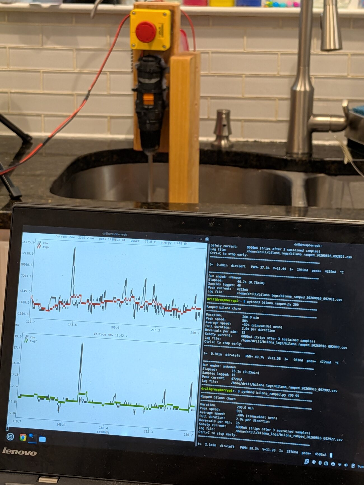
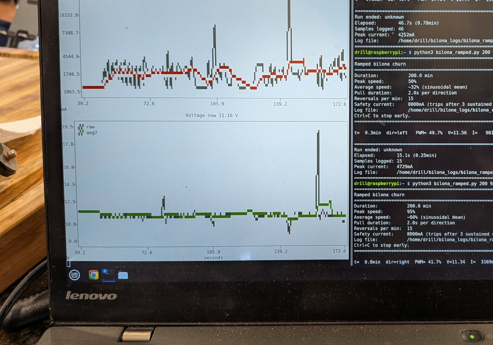

## What it is made of

A cordless drill does the turning. It sits in a clamp bolted to a chopping board, and the board is what keeps everything lined up over the pot. The churn head is hardwood on a steel shaft, screwed together rather than glued, which is the reason I made it instead of buying one.

The electronics live in a clear plastic food box, mostly so I can see whether anything has caught fire. A Raspberry Pi runs the logging. The large yellow button cuts power to the motor and nothing in software gets to override it.

| Motor | Cordless drill, clamped, running well below full speed |
| Churn | Hardwood and stainless steel, made not bought |
| Heat | Hotplate, switched on and off by an AC regulator |
| Frame | A chopping board and a plastic food box |
| Brain | Raspberry Pi, logging to a CSV |
| Sense | Current and voltage while churning, a probe in the pot while cooking |
| Stop | One large button, hard wired |

## Where it sits

Over the sink. The pot goes in the basin, a flat cover sits on top with a hole cut for the shaft, and anything that escapes lands somewhere that does not matter.

This is the part nobody puts in the render. Half of building something in a kitchen is deciding where the mess is allowed to go.

## What it watches

While it is churning, current and voltage on the motor line, sampled about once a second and written straight to a file. While it is cooking, a probe in the pot instead, and the regulator cuts the hotplate in and out to hold the number.

No microphone and no camera, which is the next thing I want to fix. The bet up to now was that if the load on its own is enough to find the break, the rest can wait.

## What it decides

Two things. Whether the load has climbed and then fallen far enough to call the break, and whether the plate should be on or off to sit at 250 F.

It does not know what yogurt is. It does not know what butter is. It knows that a number went up for a while and then dropped away, and that this shape means the job is finished.
