## खाएको मात्रै थिएँ

मैले चिनेको घ्यू गाउँबाट आउँथ्यो। पुराना सिसीमा, जुन कुनै बेला अरू नै कुराका थिए। बनाउनेहरू यति लामो समयदेखि उही तरिकाले बनाउँदै आएका छन् कि त्यहाँ कसैले यसलाई सीप नै ठान्दैन।

पसलमा पाइने टिनको जस्तो स्वाद हुँदैन।

अनि मैले एक पटक पनि बनाएको थिइनँ। दूध कति बेर छोड्ने, दही कति चिसो हुनुपर्ने, भाँडो पाकिसक्दा कस्तो आवाज आउनुपर्ने, केही थाहा थिएन।

## सुरु दहीबाट हुन्छ, सिधै क्रिमबाट होइन

कारखानाको धेरैजसो घ्यू क्रिमबाट सुरु हुन्छ। परम्परागत तरिका भने एक वा दुई दिन अगाडिबाट सुरु हुन्छ। दूध उमालेर बाक्लो पारिन्छ, त्यसैको दही जमाइन्छ, अनि रातभरि अमिलिन छोडिन्छ।

त्यो अमिलिने कुरा नै मुख्य हो। नछोडी सिधै पकायो भने पगालेको नौनी मात्र हुन्छ। मीठो त हुन्छ, तर त्यो घ्यू होइन।

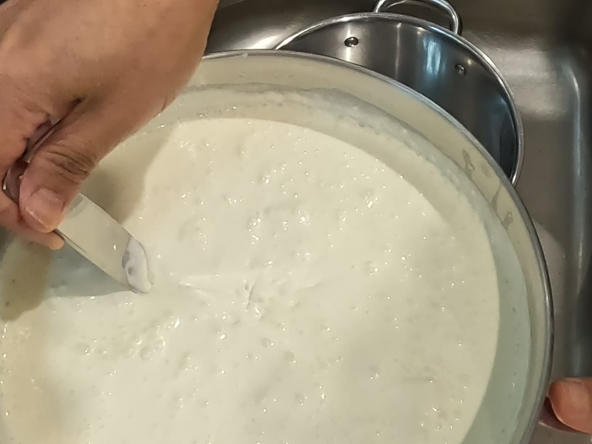

## दुई दिन बाहिरै

मनतातो दूध, हिजोको दहीको एक चम्चा, अनि राम्ररी चलाएर रातभरि छोडिदिने। बाँकी काम ब्याक्टेरियाले गर्छ। मैले भने दुई दिनसम्म बाहिरै छोडेँ।

यही हो किण्वन, र कारखानाको घ्यूले छाड्ने चरण पनि यही हो। जीवित ब्याक्टेरिया, धेरैजसो ल्याक्टोब्यासिलस, दूधको ल्याक्टोज खाँदै ल्याक्टिक एसिडमा बदल्छन्। दूध बाक्लिन्छ। अमिलिन्छ। बिहान उठ्दा त्यो अर्कै कुरा भइसकेको हुन्छ।

राम्रो भनिने सबै कुरा यहीँबाट आउँछ। ल्याक्टोज टुक्रिन्छ, त्यसैले पचाउन सजिलो हुन्छ। बोसो र प्रोटिन शरीरले सजिलै लिन सक्ने भइदिन्छन्। ब्युटिरिक एसिड पनि छ। आन्द्राको भित्री तह चल्ने भनेकै यसैले हो, र सिधै क्रिमबाट बनाएको घ्यूभन्दा यसरी बनाएकोमा धेरै हुन्छ।

आयुर्वेदले धेरै पहिलेदेखि यही तरिकाको घ्यू सिफारिस गर्दै आएको छ।

मैले भन्न सक्ने कुरा चाहिँ यत्ति हो। बास्ना दहीबाटै आउँछ। र त्यही बास्नाका लागि मात्रै पनि यो सबै झन्झट गर्न लायक छ।

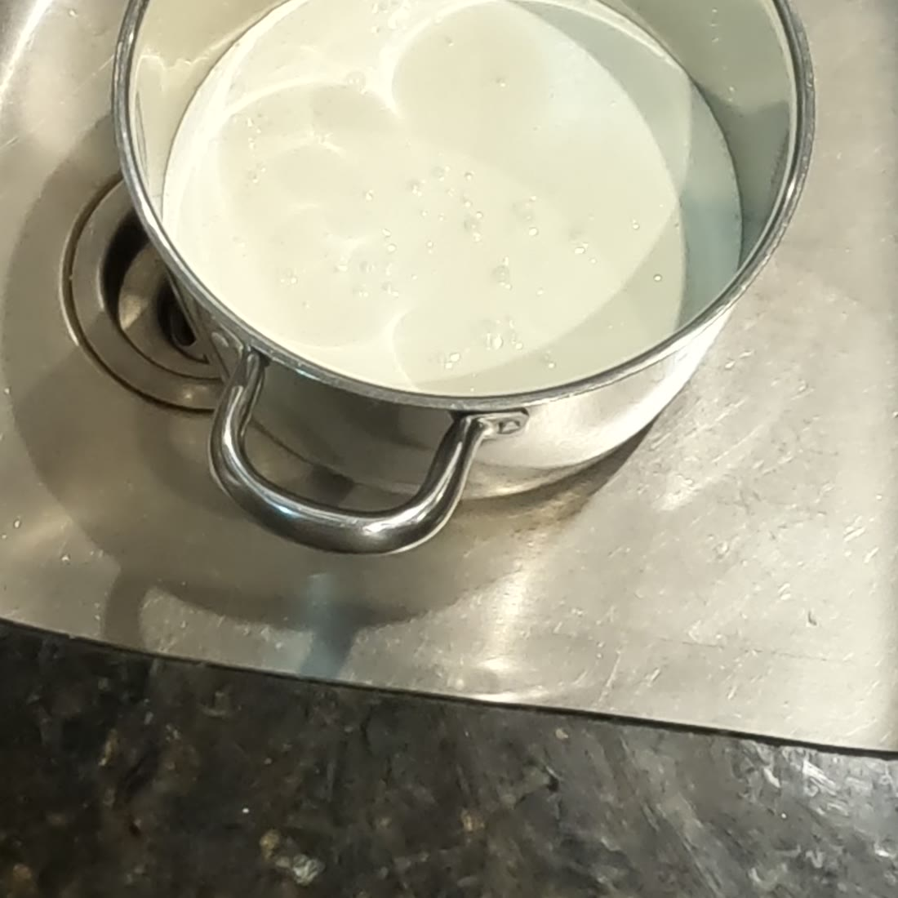

## यो तरिकाको नाम छ

बिलौना। भाँडोमा दही, त्यसमाथि काठको मदानी, अनि नौनी माथि नआउन्जेल यताउति घुमाइरहने।

मदानी मैले आफैँ बनाएँ। अनलाइनमा पाइने सबैमा गम लगाइएको थियो, र कुन गम हो भनेर कसैले भन्दैनथ्यो। त्यो चीज आधा घन्टा खानामै डुबेर बस्छ, त्यसैले अनुमानमा चल्ने कुरा थिएन। कडा काठ, स्टेनलेस स्टिलका पेच, र दराजमै रहेको स्टिररको डन्डीमा कसेको।

चार वटा पाता, र तिनलाई सिधा राख्न एउटा स्टिलको पट्टी। सबै पेचले कसेको हो, त्यसैले फेरि फुकाल्न मिल्छ।

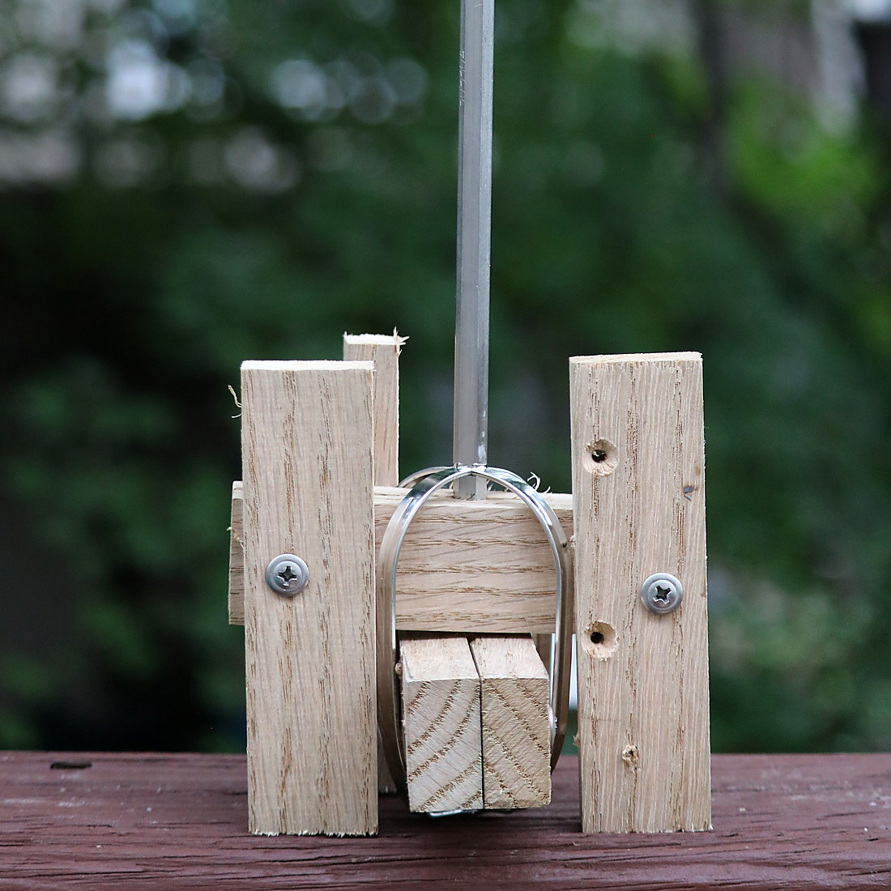
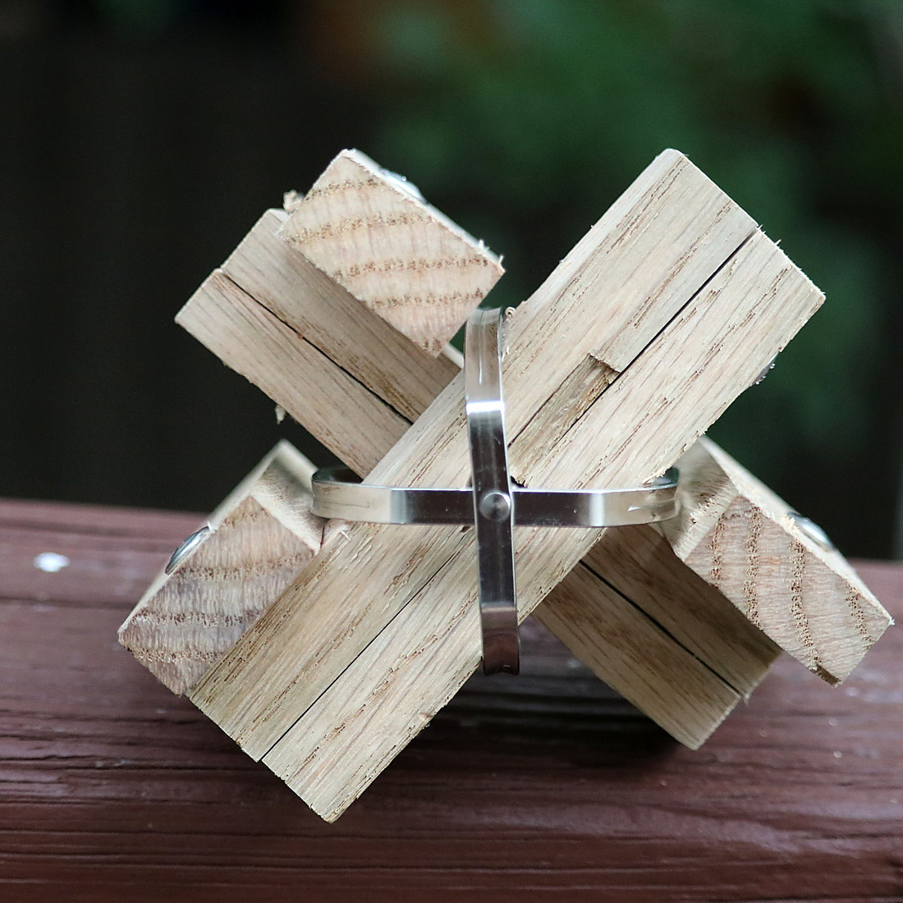

करिब आधा घन्टा लाग्छ, र त्यसको धेरैजसो बेला केही पनि हुँदैन। यस्तै कामको बेला मान्छेले सोच्छ, यो अरू कसैले गरिदिए हुन्थ्यो।

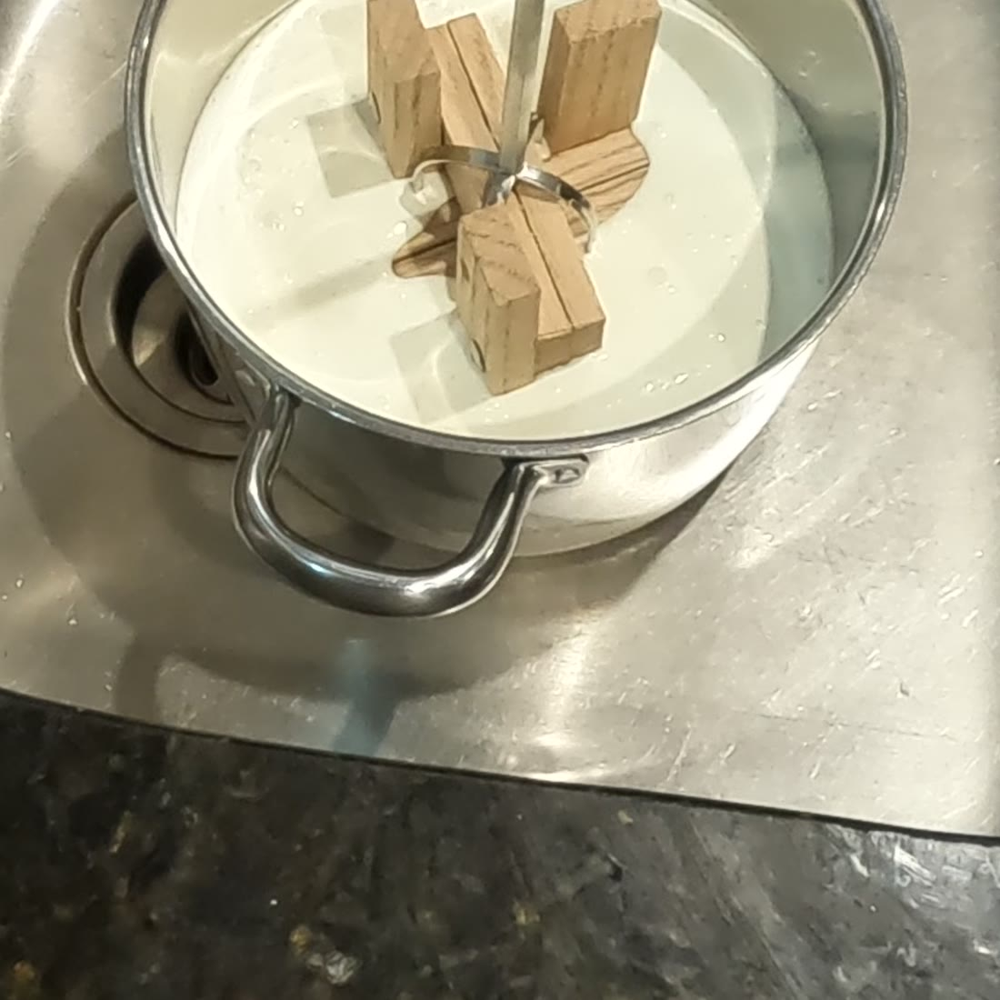

## त्यसैले सोधेँ

यो काम साँच्चै जान्नेहरू रेसिपी हेरेर बनाउँदैनन्, र तीमध्ये कोही पनि मेरो भान्सामा थिएनन्। त्यसैले प्रश्नहरू च्याटको विन्डोमा गए।

दही कति बेर जमाउने। कति चिसो राख्ने। रगडले भाँडो तातेर नौनी बिग्रिनुअघि कति छिटो घुमाउन मिल्छ। हरेक उत्तरले अरू तीन वटा प्रश्न खोलिदिन्थ्यो।

अनि मैले साँच्चै सोध्न खोजेको प्रश्न सोधेँ। तिमी आफैँ बनाइदिन सक्छौ?

> प्रश्न अब घ्यू कसरी बनाउने भन्ने रहेन। मेरा लागि तिमीले बनाइदिन सक्छौ, अब प्रश्न यही भयो।

## द बिस्ट

एउटा कर्डलेस ड्रिल। दराज र हार्डवेयर पसलबाट जुटेको मदानी। इलेक्ट्रोनिक्सका लागि प्लास्टिकको खानाको बाकस, ढाडका लागि काठको चपिङ बोर्ड, र एउटा ठूलो पहेँलो स्टप बटन, किनभने मोटर भएको जुनसुकै चीजमा त्यो हुनुपर्छ।

खर्च झन्डै केही लागेन, र हेर्दा पनि त्यस्तै देखिन्छ। कुरा पनि त्यही हो।

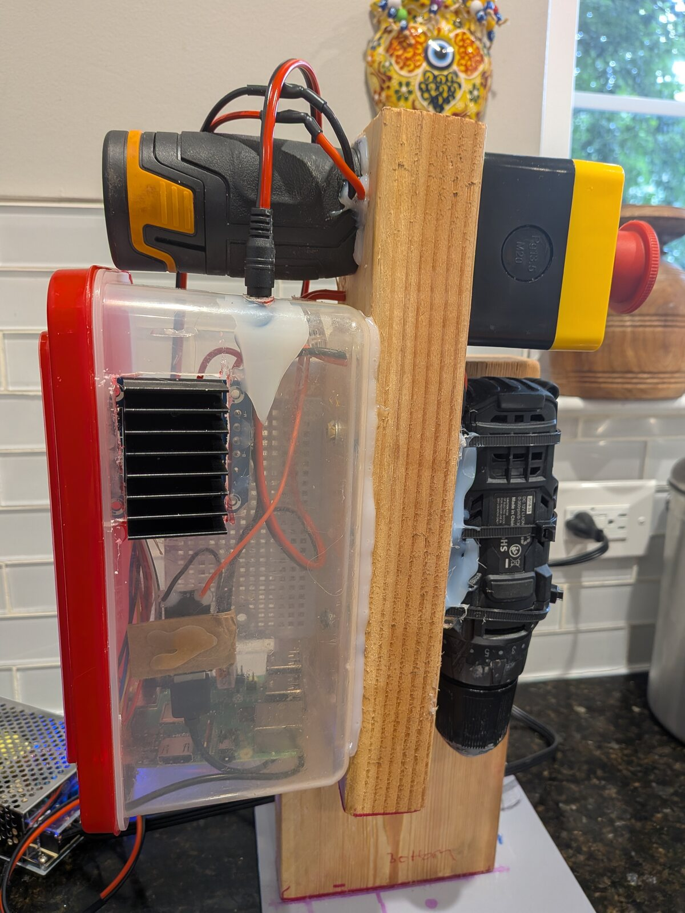

| मोटर | कर्डलेस ड्रिल, क्ल्याम्पमा कसिएको |
| मदानी | कडा काठ र स्टेनलेस स्टिल, किनेको होइन बनाएको |
| दिमाग | रास्पबेरी पाई, सेकेन्डको एक पटक लेख्ने |
| इन्द्रिय | मोही पार्दा मोटरको करेन्ट, पकाउँदा तापक्रमको प्रोब |
| रोक | एउटा ठूलो बटन, सिधै पावर काट्ने गरी जोडिएको |

## घुमाउनु त सजिलो छ

दही घुमाउन जसले पनि सक्छ। गाह्रो कुरा कहिले रोक्ने भन्ने हो।

चाँडै रोकियो भने बाक्लो फिँज मात्र हुन्छ। धेरै बेर घुमायो भने नौनी फेरि मोहीमै मिसिन्छ र हराउँछ। त्यो सही क्षण बोसो र तापक्रम अनुसार सर्छ, अनि दिनैपिच्छे पनि फरक पर्छ।

कसैले घडी हेरेर गर्दैन। सुनेर थाहा पाइन्छ। भित्रको आवाज एकनासको घुमाइबाट असमान पिटाइमा बदलिन्छ, र हात हाल्ने बेला त्यही हो।

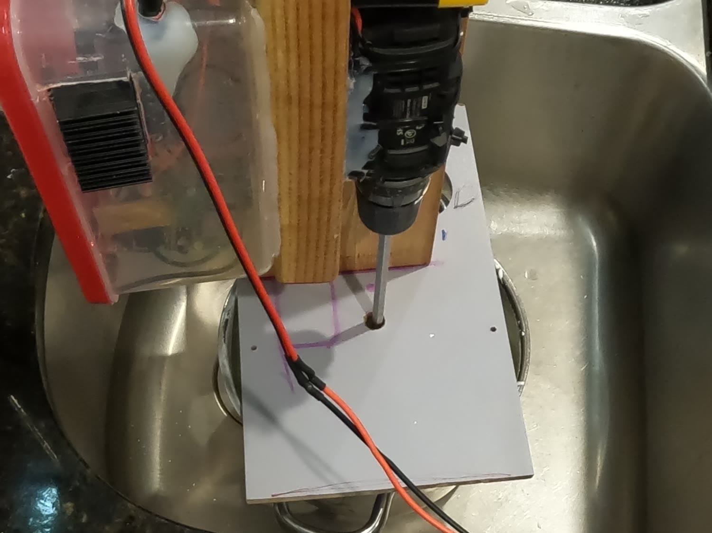

## एउटै इन्द्रिय, अरू केही होइन

त्यसैले मैले यसलाई एउटै इन्द्रिय दिएँ। मोटरले कति जोर लगाइरहेको छ, त्यही हेर्छ।

बीस मिनेटसम्म केही हुँदैन। लोड 2700 mA वरिपरि अलिअलि तलमाथि गर्दै बस्छ। अनि बोसो जम्मा हुन थाल्छ र ड्रिलले बाक्लो कुरा छिचोल्नुपर्छ। लोड 4700 सम्म चढ्छ, एक छिन त्यहीँ अडिन्छ, अनि नौनीले पानी छोड्छ र लोड घट्छ।

क्यामेरा छैन, मोडेल छैन, चलाख केही छैन। एउटा नम्बर हो, जो बढ्छ अनि घट्छ।

![मोही पार्दाको मोटर करेन्ट, लगबाट [*]](images/signal-ne.svg "एउटै मोही पार्दाको मोटर करेन्टको चार्ट। लोड बीस मिनेटसम्म करिब 2700 मिलिएम्पियरमा बस्छ, बोसो जम्मा हुँदै जाँदा चढ्छ, करिब 4700 मा पुग्छ, अनि झर्छ।")

## आफैँ रोकियो

चल्यो। म अर्कै काममा लागेँ, र फर्केर आउँदा त आफैँ बन्द भइसकेको रहेछ।

धमिलो मोहीमा हल्का पहेँलो नौनीका डल्ला। कसैले समय भनेको थिएन। आफूले महसुस गर्न सक्ने एउटै कुराबाट आफैँले पत्ता लगायो।

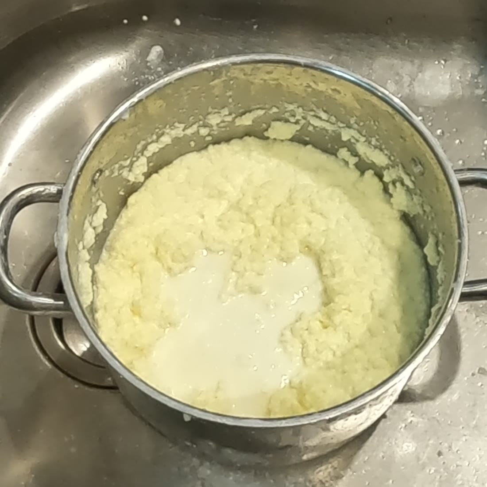

## फेरि हातकै काम

डल्लाहरू जम्मा गरेर एउटै डल्लो बनाउने। चिसो पानीले धुने, पटकपटक, पानी धमिलो आउन छोड्दासम्म।

नधोइएको मोहीको हरेक थोपा अर्को चरणमा गएर जल्छ। यो भाग मैले मेसिनलाई दिइनँ, र दिन मन पनि लागेन।

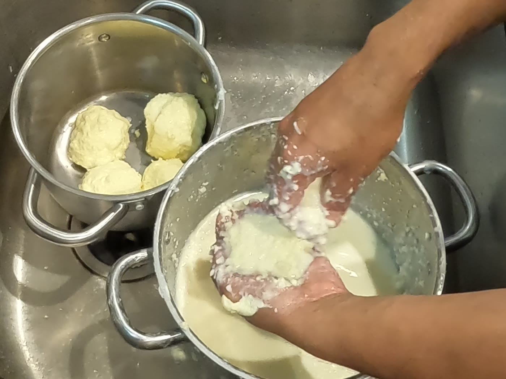
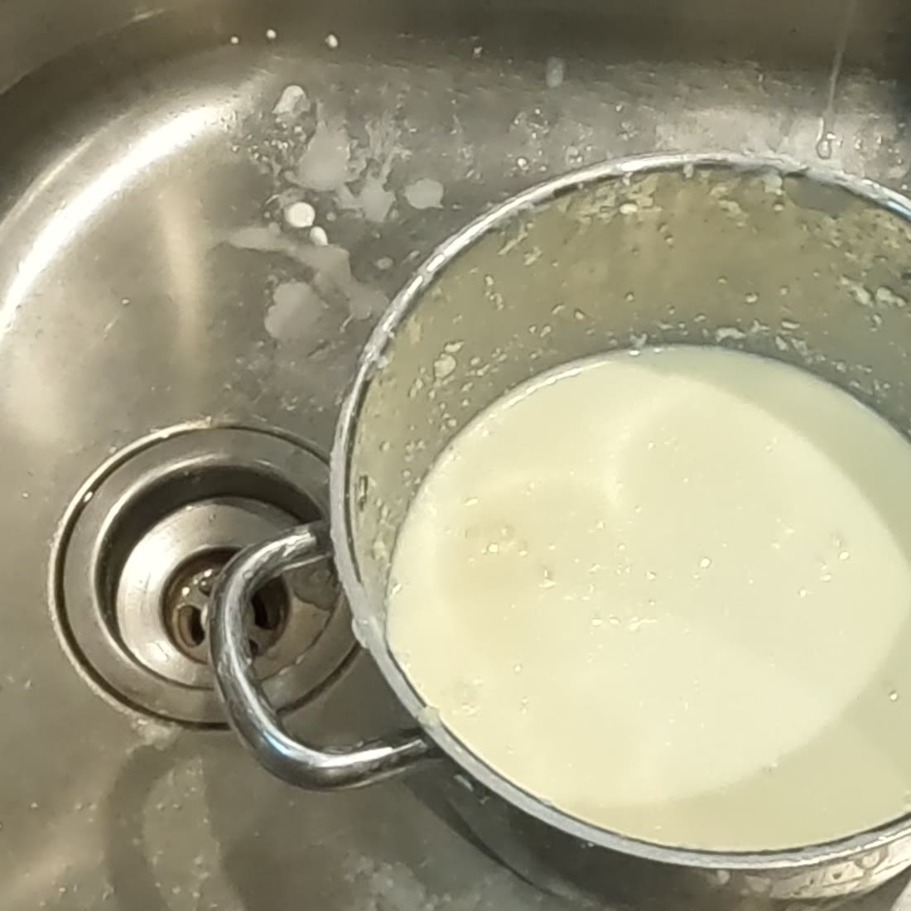

## दोस्रो इन्द्रिय

मोटरको लोडले रिगलाई कहिले रोकिने भन्यो। पकाउने काम भने अर्कै समस्या हो। अब एउटा क्षण खोज्नु पर्दैन, एउटा अवस्था टिकाइराख्नुपर्छ।

त्यसैले भाँडो हटप्लेटमा जान्छ, भित्र तापक्रमको प्रोब हुन्छ, र एउटा एसी रेगुलेटरले प्लेट अन र अफ गर्दै नम्बरलाई जहाँ सेट गरेको हो त्यहीँ अड्याइराख्छ। मैले 250 F मा राखेँ र करिब एक घन्टा त्यहीँ बस्यो।

एक घन्टासम्म भाँडो हेरेर बस्ने मान्छेको ध्यान भड्किन्छ। रेगुलेटरलाई दिक्क लाग्दैन।

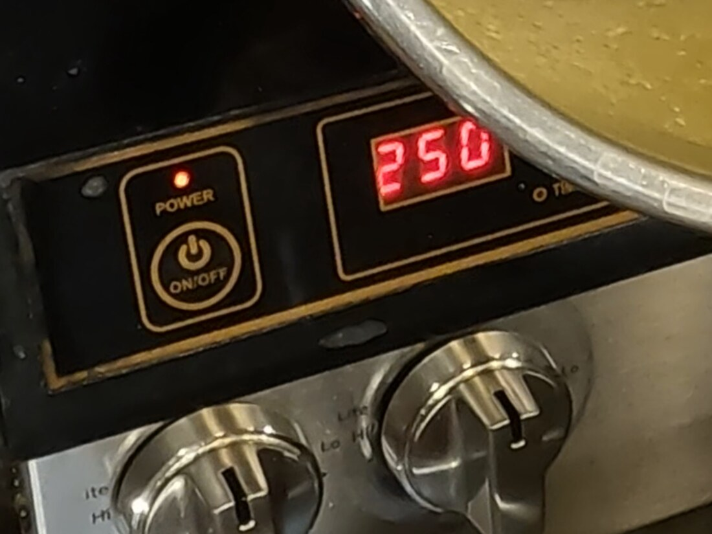

## एक घन्टा रङ हेरेर

भाँडोमा नौनी हाल्ने, अनि बाँकी आफैँ हुँदै जान्छ।

पग्लन्छ। सेतो फिँज उठेर ठूलो आवाज आउँछ। पानी सुक्दै जान्छ र आवाज मर्दै जान्छ। दूधका कण तल बसेर खैरो हुन्छन्, र बास्ना नौनीबाट भुटेको जस्तोमा बदलिन्छ। भाँडो चुपचाप हुन्छ र झोल सङ्लो देखिन थाल्छ, त्यही बेला पाकिसक्यो।

जे भए पनि मैले धेरैजसो हेरेरै बसेँ, किनभने हेर्नै राम्रो लाग्छ। तर मैले गरेको कुनै कुराले नतिजा फेरेन।

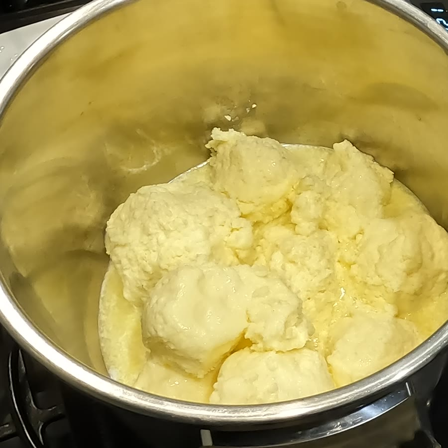
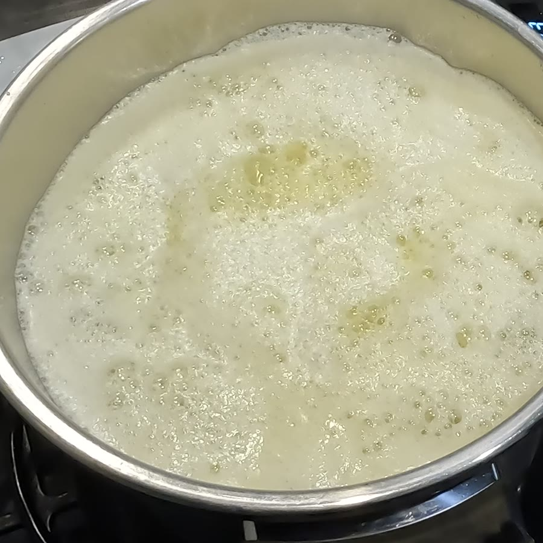
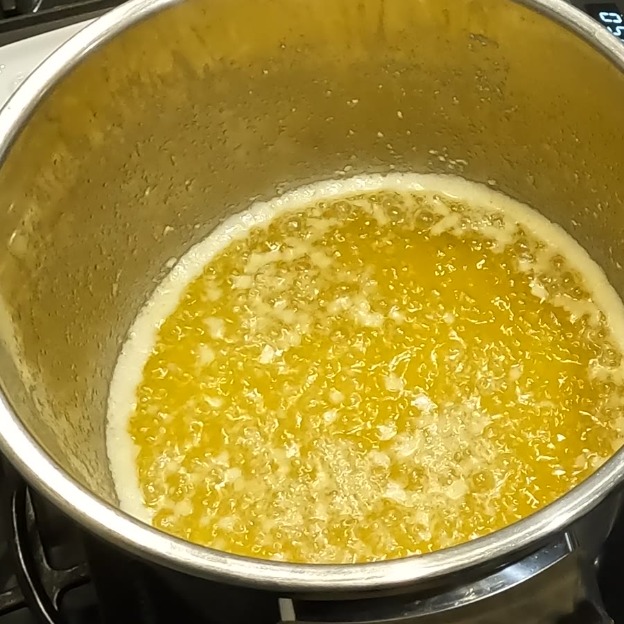
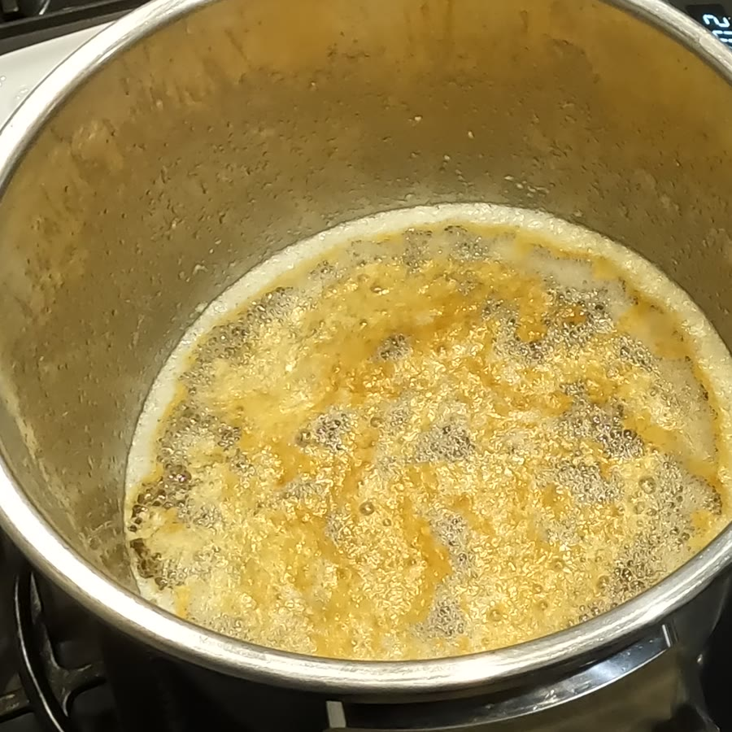
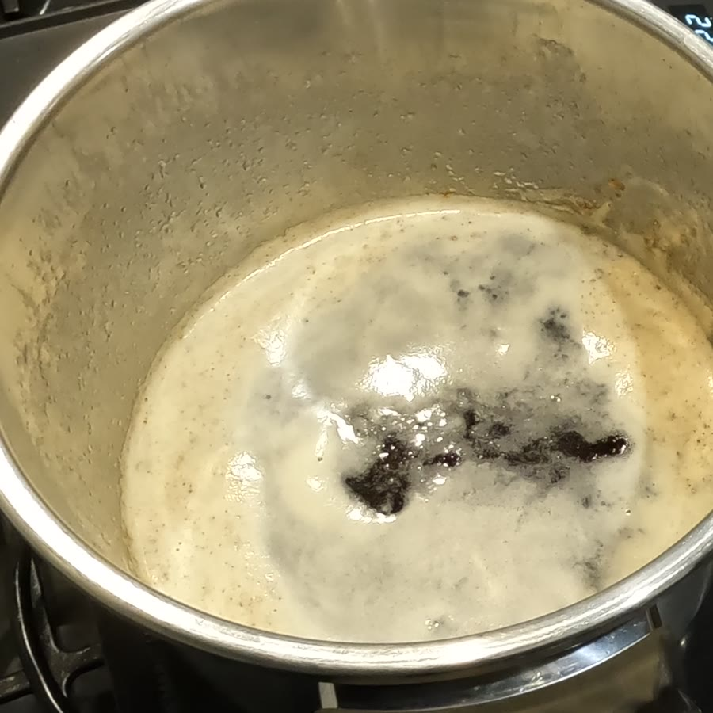

## घ्यू

सङ्लो, सुनौलो, र बास्ना ठ्याक्कै सानैदेखि खाएका ती सिसीको जस्तो। मसँग भएको एउटै परीक्षा त्यही थियो, र यो पास भयो।

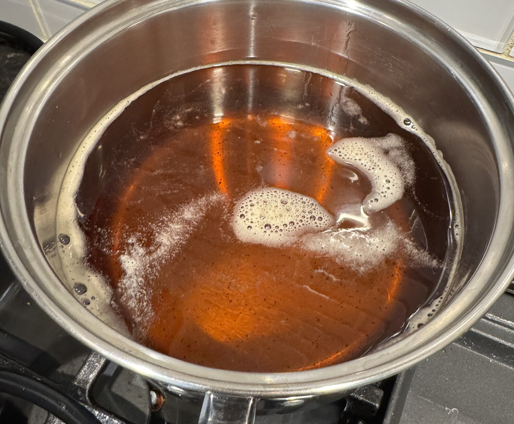

तातै र सङ्लै हुँदा सिसीमा हालेँ। भोलिपल्टसम्ममा हल्का रङको र दानादार भएर जमिसकेको थियो।

अनि सिसीमा लेबल टाँसेँ। छेउको कोडले तपाईंलाई यही पानामा फर्काएर ल्याउँछ।

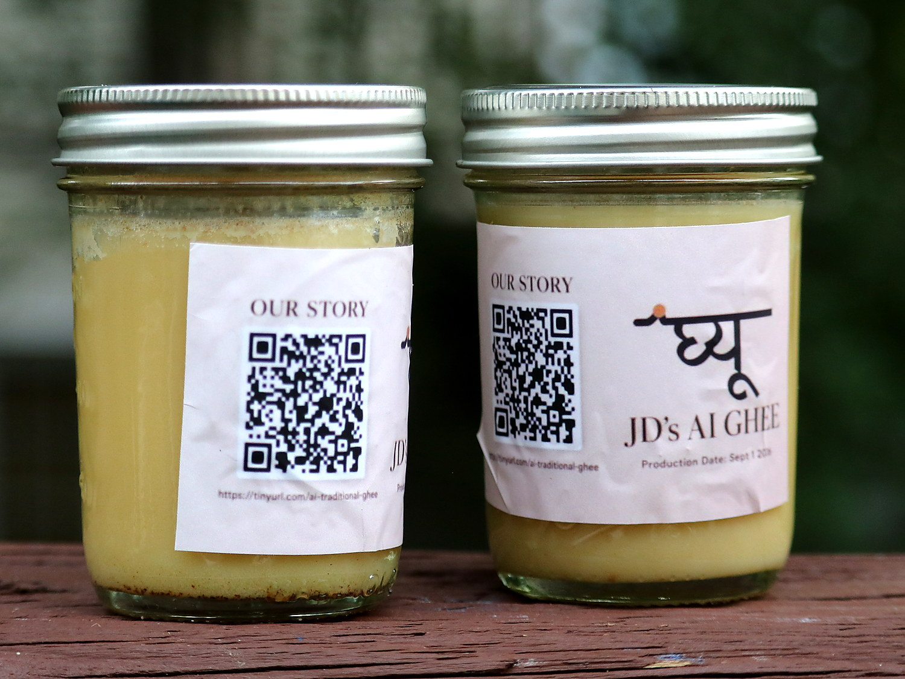

जिन्दगीको पहिलो ब्याच। साँच्चै भन्दा मैले बनाएकै होइन।

## अब के चाहिन्छ

अहिले मेसिनलाई दुई कुरा थाहा छ। मोही पार्न कहिले रोक्ने, र कति तापक्रम टिकाइराख्ने।

अब यसलाई आँखा र कान दिन मन छ। एउटा क्यामेरा। फिँज बसेको र कण खैरो भएको आफैँ हेरोस्, अनि मैले दिएको नम्बर समात्नुको साटो तापक्रम आफैँ छानोस्। अनि एउटा माइक्रोफोन, किनभने घ्यू पाक्यो भन्ने बताउने धेरै कुरा त भाँडो चुप लाग्नुमै हुन्छ।

ड्रिलले अर्को ड्युटी पनि गर्न सक्छ होला। नौनी भाँडोमा पुगेपछि चलाइरहनुपर्छ, र त्यहीँ एउटा मोटर केही नगरी बसिरहेको छ।

अनि लुप। दही जमाउने समय फेर्ने, गति फेर्ने, जे निस्कियो चाख्ने, जुन मिल्यो त्यो राख्ने, फेरि सुरुबाट। तीस पटक चलाएपछि यो कतै त्यस्तो ठाउँमा पुग्थ्यो होला, जहाँ हेर्ने कुरा मेरो दिमागमै आउँदैनथ्यो।

मलाई त कहाँ हेर्ने भन्ने नै साँच्चै थाहा थिएन।
